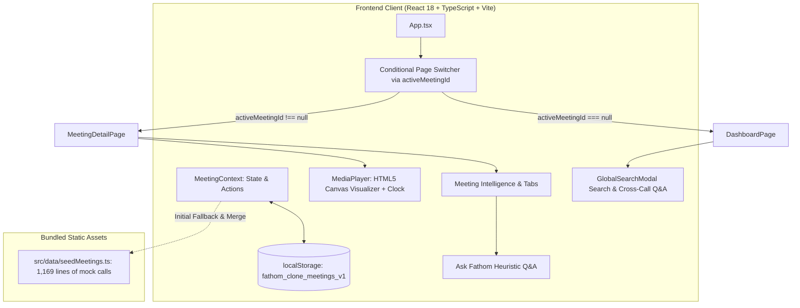
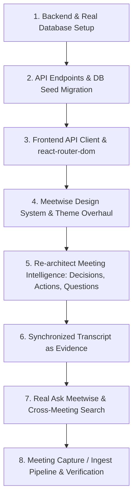
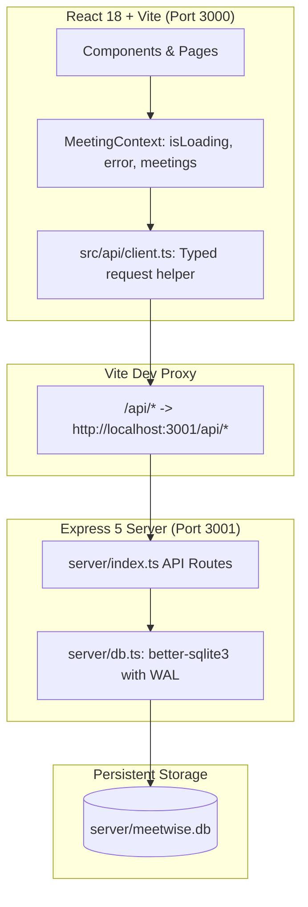
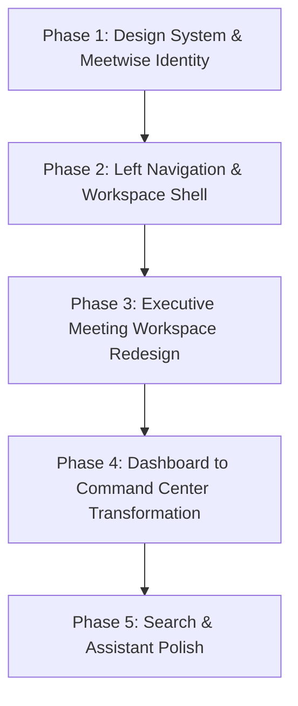

# Session Log - 2026-09-25

Session: `864aa3cb` | Project: `fanthom_clone` | Author: `jananip`

---

[LOG_ENTRY type=PROMPT num=1 session=864aa3cb]
timestamp: 2026-09-25T09:41:04Z
model: gemini-3.8-flash

You are working inside the existing project currently open in this workspace.

This is my existing React + TypeScript + Vite meeting-intelligence application. It was originally inspired by Fathom, but I now need to transform it into an original product for a revised 8x assignment.

IMPORTANT:

* Work with the existing local codebase in this workspace.
* Do NOT use or clone a GitHub repository.
* Do NOT create a new project.
* Do NOT rewrite the application from scratch.
* Do NOT modify any files yet.
* First inspect the entire existing codebase.

Inspect:

* package.json
* src structure
* routing
* components
* state management
* data models
* persistence
* localStorage usage
* mock/static data
* API-related code
* all major user flows
* existing styling/design system

Identify exactly where the following are implemented:

* dashboard
* meetings list
* meeting detail
* transcript
* synchronized transcript/playback
* summaries
* action items
* decisions
* open questions
* Ask Fathom / AI Q&A
* search
* sharing
* follow-up email
* meeting simulator
* any other major feature

The new product will be called:

MEETWISE

Product thesis:

"Most meeting tools help you remember what was said. Meetwise helps you understand what changed and what happens next."

The new product should prioritize:

1. Decisions
2. Action items
3. Open questions
4. Transcript as evidence
5. Search / AI Q&A

The revised assignment also requires:

* an original frontend design
* real backend/API
* real database
* no mock data or hardcoded responses as the primary application data source

For now, ONLY audit the project.

Return:

1. Current architecture
2. Current data flow
3. Current routes/pages
4. Important reusable components
5. Current data models
6. All localStorage usage
7. All mock/static data locations
8. Existing API/backend functionality, if any
9. What can be reused
10. What should be redesigned
11. What should eventually be removed
12. What new files/components/routes are likely needed
13. Recommended implementation order
14. Potential risks of changing the existing project

Do NOT modify files yet.


[LOG_ENTRY type=RESPONSE num=1 session=864aa3cb]
timestamp: 2026-09-25T09:44:52Z
model: gemini-3.8-flash

Here is the complete architectural and codebase audit of your existing project, in preparation for transforming it into **Meetwise**.

---

# MEETWISE — Pre-Transformation Codebase Audit

## 1. Current Architecture



* **Client Layer**: Single-page application built with **React 18.3.1**, **TypeScript 5.5.3**, and **Vite 5.4.2**.
* **Styling**: Pure CSS in [src/index.css](file:///Users/jananip/fanthom_clone/src/index.css) (1,601 lines) using CSS custom properties (dark theme: deep navy `#0a0c10`, indigo `#6366f1`, emerald `#10b981`, amber `#f59e0b`).
* **Icons**: `lucide-react` (1.16.0).
* **State Management**: React Context via [MeetingContext.tsx](file:///Users/jananip/fanthom_clone/src/context/MeetingContext.tsx). There is no external state management library (no Redux, Zustand, or TanStack Query).
* **Media & Synchronization**: Custom timer loop (500ms intervals) and HTML5 `<canvas>` sound-wave animator in [MediaPlayer.tsx](file:///Users/jananip/fanthom_clone/src/components/MediaPlayer.tsx) simulating playback and driving transcript line synchronization.
* **Backend / API**: **None exists currently.** There are no server files, no REST/GraphQL endpoints, no database drivers, and no `fetch` or `axios` calls.
* **Intelligence / AI**: All summaries, Q&A responses, citations, and search intelligence are generated client-side via heuristic substring checks and hardcoded string templates.

---

## 2. Current Data Flow

1. **Initialization**:
   * [MeetingProvider](file:///Users/jananip/fanthom_clone/src/context/MeetingContext.tsx#L49-L74) initializes `meetings` state by reading `localStorage.getItem('fathom_clone_meetings_v1')`.
   * If local storage contains data, it parses and merges it with [seedMeetings](file:///Users/jananip/fanthom_clone/src/data/seedMeetings.ts). If empty or invalid, it defaults directly to `seedMeetings`.
2. **State Updates & Persistence**:
   * A `useEffect` in [MeetingContext.tsx](file:///Users/jananip/fanthom_clone/src/context/MeetingContext.tsx#L85-L88) listens to `[meetings]`:
     ```ts
     localStorage.setItem('fathom_clone_meetings_v1', JSON.stringify(meetings));
     ```
   * All mutations (renaming title, toggling action items, switching summary templates, sharing, revoking, adding simulated meetings) mutate the in-memory array and trigger local storage serialization.
3. **Playback & Active Utterance Tracking**:
   * When playing, [MediaPlayer.tsx](file:///Users/jananip/fanthom_clone/src/components/MediaPlayer.tsx#L20-L32) ticks `currentTime` forward by `0.5 * playbackRate` every 500ms.
   * `activeUtteranceId` is derived in `MeetingContext`:
     ```ts
     activeMeeting.transcript.find(u => currentTime >= u.startTime && currentTime <= u.endTime)?.id
     ```
   * [TranscriptViewer.tsx](file:///Users/jananip/fanthom_clone/src/components/TranscriptViewer.tsx#L12-L19) listens to `activeUtteranceId` and calls `scrollIntoView({ behavior: 'smooth' })`.
4. **Action Item & Insight Provenance**:
   * Clicking a timestamp chip in [ActionItemsList.tsx](file:///Users/jananip/fanthom_clone/src/components/ActionItemsList.tsx#L16-L21) or [MeetingIntelligence.tsx](file:///Users/jananip/fanthom_clone/src/components/MeetingIntelligence.tsx#L34-L38) calls `seekTo(timestamp, true)`, which updates `currentTime` and sets `isPlaying = true`.

---

## 3. Current Routes / Pages

The app does **not** use a routing library (no `react-router-dom`). Page navigation is state-based conditional rendering inside [src/App.tsx](file:///Users/jananip/fanthom_clone/src/App.tsx#L11-L26):

```tsx
{activeMeetingId ? <MeetingDetailPage /> : <DashboardPage />}
```

### Pages Implemented:
* **Dashboard** ([src/pages/DashboardPage.tsx](file:///Users/jananip/fanthom_clone/src/pages/DashboardPage.tsx)):
  * Aggregated stats pills (Total Calls, Audio Captured, Tracked Actions).
  * Filter bar with text search (title, overview, attendee) and `#tag` pill filter.
  * Responsive grid of [MeetingCard](file:///Users/jananip/fanthom_clone/src/components/MeetingCard.tsx) items.
* **Meeting Detail** ([src/pages/MeetingDetailPage.tsx](file:///Users/jananip/fanthom_clone/src/pages/MeetingDetailPage.tsx)):
  * Header with back button, inline editable meeting title, date/duration metadata, Follow-up Email modal trigger, and Share modal trigger.
  * Left pane: [MediaPlayer](file:///Users/jananip/fanthom_clone/src/components/MediaPlayer.tsx) (canvas audio waveform, scrubber with topic chapter markers, play/pause/skip controls, attendee list).
  * Right pane: Tabbed workspace switching between:
    * `Summary` -> [SummaryViewer.tsx](file:///Users/jananip/fanthom_clone/src/components/SummaryViewer.tsx) + [MeetingIntelligence.tsx](file:///Users/jananip/fanthom_clone/src/components/MeetingIntelligence.tsx)
    * `Action Items` -> [ActionItemsList.tsx](file:///Users/jananip/fanthom_clone/src/components/ActionItemsList.tsx)
    * `Transcript` -> [TranscriptViewer.tsx](file:///Users/jananip/fanthom_clone/src/components/TranscriptViewer.tsx)
    * `Ask Fathom` -> [AskFathomChat.tsx](file:///Users/jananip/fanthom_clone/src/components/AskFathomChat.tsx)
    * `Highlights` -> [HighlightsViewer.tsx](file:///Users/jananip/fanthom_clone/src/components/HighlightsViewer.tsx)

---

## 4. Important Reusable Components

| Component | File Path | Role & Reusability |
| :--- | :--- | :--- |
| **`AppHeader`** | [src/components/AppHeader.tsx](file:///Users/jananip/fanthom_clone/src/components/AppHeader.tsx) | Sticky navigation bar, brand icon/title, global search trigger (`⌘K`), capture meeting button. |
| **`MeetingCard`** | [src/components/MeetingCard.tsx](file:///Users/jananip/fanthom_clone/src/components/MeetingCard.tsx) | Card component rendering meeting summary, action count, attendee avatars, tags, and click-to-view. |
| **`MediaPlayer`** | [src/components/MediaPlayer.tsx](file:///Users/jananip/fanthom_clone/src/components/MediaPlayer.tsx) | Canvas waveform visualizer, scrubber bar with chapter markers, playback speed toggle, active speaker indicator. |
| **`MeetingIntelligence`** | [src/components/MeetingIntelligence.tsx](file:///Users/jananip/fanthom_clone/src/components/MeetingIntelligence.tsx) | Displays traceable decisions, action items, and open questions with one-click audio/transcript seek. |
| **`SummaryViewer`** | [src/components/SummaryViewer.tsx](file:///Users/jananip/fanthom_clone/src/components/SummaryViewer.tsx) | Template selector dropdown, executive overview, key decisions, template sections, topic agenda accordion. |
| **`ActionItemsList`** | [src/components/ActionItemsList.tsx](file:///Users/jananip/fanthom_clone/src/components/ActionItemsList.tsx) | Action items with completion checkbox, owner pill, direct spoken quotation, and jump-to-audio button. |
| **`TranscriptViewer`** | [src/components/TranscriptViewer.tsx](file:///Users/jananip/fanthom_clone/src/components/TranscriptViewer.tsx) | Searchable transcript, speaker avatar/name tags, auto-scroll toggle, live utterance highlight, word match highlighting. |
| **`AskFathomChat`** | [src/components/AskFathomChat.tsx](file:///Users/jananip/fanthom_clone/src/components/AskFathomChat.tsx) | Conversational Q&A chat interface with prompt suggestion pills and clickable audio evidence citations. |
| **`HighlightsViewer`** | [src/components/HighlightsViewer.tsx](file:///Users/jananip/fanthom_clone/src/components/HighlightsViewer.tsx) | Key soundbite clips tagged by category, jump buttons, and clip link copy. |
| **`SharingModal`** | [src/components/SharingModal.tsx](file:///Users/jananip/fanthom_clone/src/components/SharingModal.tsx) | Attendee toggles, external recipient sharing with security warning confirmation, active share revocation. |
| **`FollowUpEmailModal`** | [src/components/FollowUpEmailModal.tsx](file:///Users/jananip/fanthom_clone/src/components/FollowUpEmailModal.tsx) | Follow-up email composer with 3 tone styles, attendee prefill, and one-click copy. |
| **`GlobalSearchModal`** | [src/components/GlobalSearchModal.tsx](file:///Users/jananip/fanthom_clone/src/components/GlobalSearchModal.tsx) | Cross-meeting search across titles, spoken transcripts, and action items with `⌘K` shortcut. |
| **`SimulateMeetingModal`**| [src/components/SimulateMeetingModal.tsx](file:///Users/jananip/fanthom_clone/src/components/SimulateMeetingModal.tsx) | Multi-step simulation of bot joining call, diarizing speech, and extracting summaries. |
| **`ToastManager`** | [src/components/ToastManager.tsx](file:///Users/jananip/fanthom_clone/src/components/ToastManager.tsx) | Bottom-floating toast with 5-second countdown timer and reversible Undo action. |

---

## 5. Current Data Models ([src/types.ts](file:///Users/jananip/fanthom_clone/src/types.ts))

* **`Participant`**: `id, name, email, avatar, role, color`
* **`TranscriptUtterance`**: `id, speakerId, speakerName, speakerAvatar, startTime, endTime, text`
* **`ActionItem`**: `id, title, assignee (Participant), completed, timestamp, sourceQuote`
* **`DecisionInsight`**: `id?, text, timestamp?`
* **`OpenQuestion`**: `id, question, timestamp?, speakerName?, context?`
* **`Highlight`**: `id, title, startTime, endTime, speakerName, summary, tag`
* **`TopicDiscussion`**: `title, timestamp, bullets`
* **`SummaryTemplate`**: `key, name, description, overview, sections: { heading, bullets }[]`
* **`ShareRecipient`**: `email, name?, avatar?, isAttendee, sharedAt, revoked`
* **`Meeting`**:
  ```ts
  {
    id: string;
    title: string;
    originalCalendarTitle?: string;
    date: string;
    durationSeconds: number;
    participants: Participant[];
    overview: string;
    keyDecisions: string[];
    keyDecisionDetails?: DecisionInsight[];
    topics: TopicDiscussion[];
    actionItems: ActionItem[];
    highlights: Highlight[];
    openQuestions?: OpenQuestion[];
    transcript: TranscriptUtterance[];
    shares: ShareRecipient[];
    activeTemplate: string;
    templates: Record<string, SummaryTemplate>;
    suggestedQuestions: string[];
    tags: string[];
  }
  ```
* **`ChatMessage`**: `id, sender ('user' | 'assistant'), timestamp, text, citations?`

---

## 6. All LocalStorage Usage

LocalStorage is accessed exclusively in **one file**:
* **File**: [src/context/MeetingContext.tsx](file:///Users/jananip/fanthom_clone/src/context/MeetingContext.tsx)
  * **Key name**: `'fathom_clone_meetings_v1'` (Line 47)
  * **Read location**: Line 51 (`localStorage.getItem(STORAGE_KEY)`) inside `useState<Meeting[]>` initial factory function.
  * **Write location**: Line 87 (`localStorage.setItem(STORAGE_KEY, JSON.stringify(meetings))`) inside a `useEffect` keyed on `[meetings]`.

---

## 7. All Mock / Static Data Locations

| Location | Lines | Content |
| :--- | :--- | :--- |
| [src/data/seedMeetings.ts](file:///Users/jananip/fanthom_clone/src/data/seedMeetings.ts) | 1–1169 | Complete static database containing: 8 team participants with Unsplash avatars, and 4 full meetings (`smarteval-arch-sync`, `fathom-product-sync`, `acme-customer-advisory`, `quarterly-all-hands`) with hardcoded transcripts, action items, decisions, open questions, highlights, and agenda topics. |
| [src/components/SimulateMeetingModal.tsx](file:///Users/jananip/fanthom_clone/src/components/SimulateMeetingModal.tsx) | 25–144 | Hardcoded meeting object generator creating a pre-scripted "Mobile Audio Transcription Latency" meeting. |
| [src/components/AskFathomChat.tsx](file:///Users/jananip/fanthom_clone/src/components/AskFathomChat.tsx) | 54–111 | Canned heuristic Q&A matching on words like `"latency"`, `"sqlite"`, `"sharing"`, `"undo"`, `"title"`, `"pilot"`, `"acme"`. |
| [src/components/GlobalSearchModal.tsx](file:///Users/jananip/fanthom_clone/src/components/GlobalSearchModal.tsx) | 88–114 | Hardcoded canned cross-meeting AI answers for `"smarteval"`, `"pilot"`, `"sharing"`. |
| [src/components/FollowUpEmailModal.tsx](file:///Users/jananip/fanthom_clone/src/components/FollowUpEmailModal.tsx) | 27–105 | Static template strings for generating email text variants. |

---

## 8. Existing API / Backend Functionality

* **Backend server**: None. No Node/Express/Fastify/Python backend exists.
* **Database**: None. The app runs completely in browser memory and `localStorage`.
* **API calls**: None. No `fetch()`, `axios`, or REST endpoints exist in the frontend.
* **Utility scripts**: [scripts/capture.py](file:///Users/jananip/fanthom_clone/scripts/capture.py) is a workspace Python script for logging agent turns into `.agent-logs/`. It is not an application backend.

---

## 9. What Can Be Reused

1. **Audio/Video Synchronized Playback Model**: The core mechanism in [MediaPlayer.tsx](file:///Users/jananip/fanthom_clone/src/components/MediaPlayer.tsx) and [TranscriptViewer.tsx](file:///Users/jananip/fanthom_clone/src/components/TranscriptViewer.tsx) calculating `activeUtteranceId` based on `currentTime` and smoothly scrolling to active speech.
2. **Provenance / Jump-to-Evidence UI**: The pattern of attaching exact timestamp buttons (`Jump to mm:ss`) and source quotes to items so users can instantly verify claims against spoken conversation.
3. **Modal Infrastructure**: Keyboard-driven modals (`⌘K` modal in [GlobalSearchModal.tsx](file:///Users/jananip/fanthom_clone/src/components/GlobalSearchModal.tsx), Follow-up email modal, Sharing modal).
4. **Toast Notification Pattern**: [ToastManager.tsx](file:///Users/jananip/fanthom_clone/src/components/ToastManager.tsx) with undo actions.
5. **Domain Types**: The core TypeScript interfaces in [types.ts](file:///Users/jananip/fanthom_clone/src/types.ts) provide a solid starting point for database schemas and API request/response contracts.
6. **Seed Content for DB Ingestion**: [src/data/seedMeetings.ts](file:///Users/jananip/fanthom_clone/src/data/seedMeetings.ts) can be converted into a real database seed script so the app starts with realistic meetings in SQLite/Postgres.

---

## 10. What Should Be Redesigned

1. **Branding & Visual Identity**:
   * Change branding from **Fathom** to **MEETWISE**.
   * Replace the dark-blue/indigo theme with an original, distinctive Meetwise design system (curated palette, refined typography, modern contrast, clear visual hierarchy).
2. **Information Architecture (Thesis Alignment)**:
   * **Meetwise Thesis**: *"Most meeting tools help you remember what was said. Meetwise helps you understand what changed and what happens next."*
   * In the current Fathom clone, "Summary" is the primary tab, while Decisions and Open Questions are buried inside [MeetingIntelligence.tsx](file:///Users/jananip/fanthom_clone/src/components/MeetingIntelligence.tsx).
   * **Redesign**: Elevate **Decisions**, **Action Items**, and **Open Questions** as top-level primary entities. Emphasize **"What Changed"** (decisions that alter roadmap, architecture, or policy) and **"What Happens Next"** (assigned commitments with deadlines).
3. **Transcript as Evidence**:
   * The transcript should not just be a wall of text; it must serve as verifiable proof for decisions and action items, highlighting relevant excerpts when inspecting a decision or commitment.
4. **Client-Server Architecture**:
   * Replace `localStorage` with a typed HTTP API client calling a real backend API.
5. **Real Search & AI Q&A**:
   * Replace regex/keyword matching with real backend-powered semantic search and LLM synthesis.
6. **URL Routing**:
   * Replace conditional rendering with standard URL routes (e.g. `/`, `/meetings/:id`, `/meetings/:id/decisions`) using `react-router-dom` for reliable browser navigation, deep linking, and shareable URLs.

---

## 11. What Should Eventually Be Removed

1. All Fathom branding strings and assets ("Fathom", "Ask Fathom", "Fathom Intelligence").
2. `fathom_clone_meetings_v1` local storage key and synchronization effects in [MeetingContext.tsx](file:///Users/jananip/fanthom_clone/src/context/MeetingContext.tsx).
3. Hardcoded regex/if-else response trees in [AskFathomChat.tsx](file:///Users/jananip/fanthom_clone/src/components/AskFathomChat.tsx) and [GlobalSearchModal.tsx](file:///Users/jananip/fanthom_clone/src/components/GlobalSearchModal.tsx).
4. Direct client bundling of [seedMeetings.ts](file:///Users/jananip/fanthom_clone/src/data/seedMeetings.ts) as the primary state source.
5. In-memory simulated meeting generator inside [SimulateMeetingModal.tsx](file:///Users/jananip/fanthom_clone/src/components/SimulateMeetingModal.tsx).

---

## 12. What New Files / Components / Routes Are Likely Needed

### Backend & Database:
* **Server**: `server/index.ts` (Express/Fastify/Node.js or Python FastAPI/Flask).
* **Database**: `server/db.ts` or SQLite database (`better-sqlite3`, Prisma, or Drizzle) with tables for `meetings`, `participants`, `transcript_utterances`, `decisions`, `action_items`, `open_questions`, `shares`.
* **Seed Script**: `server/seed.ts` to populate the real database.
* **API Endpoints**:
  * `GET /api/meetings` — List all meetings with stats.
  * `GET /api/meetings/:id` — Full meeting detail with decisions, actions, questions, transcript.
  * `POST /api/meetings` — Ingest / capture a new meeting.
  * `PATCH /api/meetings/:id/actions/:actionId` — Update action item status.
  * `PATCH /api/meetings/:id` — Update title, template, or metadata.
  * `POST /api/meetings/:id/chat` — Real AI Q&A with grounded citations.
  * `GET /api/search?q=...` — Real cross-meeting search.

### Frontend:
* **API Client**: `src/api/client.ts` — Typed network client for all endpoints.
* **Routing**: `react-router-dom` configured in `src/App.tsx`.
* **New / Redesigned Components**:
  * `src/components/DecisionsBoard.tsx` — Displays decisions categorized by impact, status, and what changed, with direct links to transcript evidence.
  * `src/components/WhatChangedWidget.tsx` — Visual summary of state shifts (e.g. before vs after decisions).
  * `src/components/NextStepsBoard.tsx` — Dedicated view of commitments, owners, due dates, and evidence quotes.
  * `src/components/OpenQuestionsTracker.tsx` — Unresolved questions, speaker context, and resolution status.
  * `src/components/AskMeetwiseChat.tsx` — Replaces AskFathomChat with backend-connected AI.
  * `src/components/EvidenceDrawer.tsx` or enhanced `TranscriptViewer.tsx` — Transcript styled specifically as verifiable evidence.

---

## 13. Recommended Implementation Order



1. **Step 1: Backend & Real Database**: Set up a lightweight, robust backend (e.g. Node/Express + SQLite) within the workspace, define schema models (`meetings`, `decisions`, `actions`, `questions`, `utterances`).
2. **Step 2: Database Seeding & API Endpoints**: Migrate static seed data into the database and implement REST endpoints.
3. **Step 3: Routing & API Client**: Install `react-router-dom`, implement `src/api/client.ts`, and wire data loading into the app.
4. **Step 4: Meetwise Design System**: Overhaul styling in `src/index.css` to give Meetwise an original, premium, high-contrast visual identity and branding.
5. **Step 5: Prioritize Decisions, Actions & Open Questions**: Restructure the meeting detail view to lead with what changed (Decisions) and what happens next (Actions & Open Questions).
6. **Step 6: Transcript as Evidence**: Ensure every decision and action item highlights and seeks directly to the exact spoken quote in the transcript and player.
7. **Step 7: Search & Ask Meetwise**: Connect cross-meeting search and call Q&A to the backend.
8. **Step 8: Meeting Ingest & Testing**: Provide a capture/upload flow that creates real records in the database, verifying complete functionality without localStorage dependencies.

---

## 14. Potential Risks of Changing the Existing Project

1. **Breaking State Assumptions**: The existing frontend assumes all meetings are synchronously available in a single in-memory array (`meetings: Meeting[]`). Moving to an asynchronous API requires handling loading states, errors, and pagination carefully to avoid blank screen regressions.
2. **Playback & Transcript Desynchronization**: The synchronized speech-to-playhead tracking relies on precise float timestamps (`startTime` and `endTime`). Any database type conversion (e.g. integer vs float) could cause playhead seeking to miss the target utterance.
3. **CSS Class Interdependence**: `src/index.css` is 1,601 lines with shared class names. Styling updates must maintain layout structure while applying the new Meetwise visual language.
4. **Preserving Logging Integrity**: [scripts/capture.py](file:///Users/jananip/fanthom_clone/scripts/capture.py) monitors workspace changes for assignment tracking; workspace modifications should not break this capture script or its references.

---

*This concludes the initial audit. No files were modified. Ready to begin implementation upon your instruction.*


[LOG_ENTRY type=PROMPT num=2 session=864aa3cb]
timestamp: 2026-09-25T09:49:52Z
model: gemini-3.8-flash

The audit is complete. Do not redesign the frontend yet.

Now implement the real backend and database required by the 8x assignment.

The current application has:

* React 18 + TypeScript + Vite
* React Context for state
* seedMeetings.ts containing the current meeting data
* localStorage persistence
* no backend
* no API
* no database

The assignment now explicitly requires:
"A working database and API, not mock data or hardcoded responses."

IMPORTANT:

* Work ONLY inside the existing local workspace.
* Do NOT clone anything from GitHub.
* Do NOT create a second frontend.
* Do NOT redesign the UI yet.
* Do NOT delete existing frontend functionality.
* Do NOT remove localStorage yet; we will do that only after the backend is verified.
* Preserve the existing frontend while building the backend underneath it.

## Backend architecture

Use a simple, reliable architecture suitable for this project and deadline.

Preferred stack:

* Node.js
* Express
* TypeScript
* SQLite

Use a lightweight database library such as better-sqlite3, unless the existing environment makes another choice clearly safer.

Do NOT introduce unnecessary infrastructure such as:

* microservices
* Docker
* Redis
* message queues
* Kubernetes
* complex authentication
* unnecessary cloud services

The goal is a genuinely working local API + database.

## Database

Create a real SQLite database with appropriate tables based on the existing TypeScript models.

At minimum support:

1. meetings
2. participants
3. transcript_utterances
4. action_items
5. decisions
6. open_questions

Preserve the existing relationships and IDs where practical so existing frontend behavior can continue to work.

Important:
Transcript timestamps must remain precise enough to preserve the existing synchronized playback and jump-to-evidence behavior.

## Seed migration

The existing:

src/data/seedMeetings.ts

contains the current meeting data.

Convert this data into a database seed process.

Do NOT simply import seedMeetings.ts directly into the frontend after this migration.

Create something like:

server/seed.ts

that reads/converts the existing seed data and inserts it into SQLite.

The database should contain the existing realistic meetings after seeding.

Do not lose:

* transcripts
* participants
* action items
* decisions
* open questions
* highlights
* meeting metadata
* timestamps
* source quotes

If some existing fields are not needed in the first database version, document them rather than silently deleting them.

## API

Implement these endpoints first:

GET /api/meetings
Returns meeting list and useful summary metadata.

GET /api/meetings/:id
Returns complete meeting information needed by the existing meeting page.

GET /api/meetings/:id/transcript
Returns transcript utterances.

GET /api/meetings/:id/actions
Returns action items.

PATCH /api/meetings/:id/actions/:actionId
Updates an action item's completion status.

GET /api/meetings/:id/decisions
Returns decisions.

GET /api/meetings/:id/questions
Returns open questions.

PATCH /api/meetings/:id
Allows supported meeting metadata updates such as title.

GET /api/search?q=
Provides real database-backed cross-meeting search.

Do not implement fake responses.

Every response should ultimately come from the SQLite database.

## Backend quality

Add:

* proper HTTP status codes
* JSON responses
* basic validation
* meaningful error responses
* centralized database access where practical
* environment configuration where appropriate

Do not hardcode database credentials or secrets.

## Frontend integration

DO NOT fully migrate the frontend yet.

For this step, the priority is:

React frontend
↓
future API client
↓
Express API
↓
SQLite

Build and verify the backend independently first.

You may add a basic health endpoint:

GET /api/health

returning something like:

{
"status": "ok"
}

## Scripts

Update package.json with clear scripts for:

* frontend development
* backend development
* database initialization/seeding
* production build if appropriate

Do not break the existing frontend development command.

## Verification

After implementation:

1. Start the backend.
2. Initialize/seed the SQLite database.
3. Call /api/health.
4. Call /api/meetings.
5. Call /api/meetings/:id.
6. Verify transcript data.
7. Verify action items.
8. Verify decisions.
9. Verify open questions.
10. Update an action item through PATCH.
11. Read it again and verify the change persisted in SQLite.
12. Test search.
13. Run TypeScript/build checks.

Do not redesign any UI in this step.

Do not remove localStorage yet.

At the end, report:

1. Backend stack chosen
2. Database schema
3. API endpoints implemented
4. Files created
5. Files modified
6. Commands to run backend
7. Commands to seed database
8. How you verified persistence
9. Any existing frontend assumptions that need to be addressed during the next migration step

STOP after this implementation. Do not continue into frontend redesign automatically.


[LOG_ENTRY type=RESPONSE num=2 session=864aa3cb]
timestamp: 2026-09-25T09:59:53Z
model: gemini-3.8-flash

The real backend and database implementation for **Meetwise** is complete and verified. The existing frontend code and `localStorage` persistence remain untouched.

---

### 1. Backend Stack Chosen

* **Runtime**: Node.js (v22.15.0) with TypeScript execution via `tsx` (fast native ESM/TypeScript without build step overhead).
* **Framework**: **Express 5** (`express`, `cors`, `dotenv`).
* **Database**: **SQLite** via **`better-sqlite3`** (synchronous C++ bindings, WAL journal mode enabled, foreign keys enforced).
* **Architecture**: Local client-server architecture with centralized database access and transactional seeding.

---

### 2. Database Schema

The SQLite schema is implemented in [server/db.ts](file:///Users/jananip/fanthom_clone/server/db.ts) and supports full fidelity with the TypeScript models in [src/types.ts](file:///Users/jananip/fanthom_clone/src/types.ts):

```sql
-- 1. Participants
CREATE TABLE participants (
  id TEXT PRIMARY KEY,
  name TEXT NOT NULL,
  email TEXT NOT NULL UNIQUE,
  avatar TEXT NOT NULL,
  role TEXT NOT NULL,
  color TEXT NOT NULL
);

-- 2. Meetings
CREATE TABLE meetings (
  id TEXT PRIMARY KEY,
  title TEXT NOT NULL,
  original_calendar_title TEXT,
  date TEXT NOT NULL,
  duration_seconds REAL NOT NULL,
  overview TEXT NOT NULL,
  active_template TEXT DEFAULT 'executive',
  templates_json TEXT NOT NULL,
  suggested_questions_json TEXT NOT NULL,
  tags_json TEXT NOT NULL,
  created_at TEXT DEFAULT CURRENT_TIMESTAMP,
  updated_at TEXT DEFAULT CURRENT_TIMESTAMP
);

-- 3. Meeting <-> Participants Association
CREATE TABLE meeting_participants (
  meeting_id TEXT NOT NULL REFERENCES meetings(id) ON DELETE CASCADE,
  participant_id TEXT NOT NULL REFERENCES participants(id) ON DELETE CASCADE,
  PRIMARY KEY (meeting_id, participant_id)
);

-- 4. Transcript Utterances (Precise REAL timestamps for playhead sync)
CREATE TABLE transcript_utterances (
  id TEXT PRIMARY KEY,
  meeting_id TEXT NOT NULL REFERENCES meetings(id) ON DELETE CASCADE,
  speaker_id TEXT NOT NULL REFERENCES participants(id),
  speaker_name TEXT NOT NULL,
  speaker_avatar TEXT NOT NULL,
  start_time REAL NOT NULL,
  end_time REAL NOT NULL,
  text TEXT NOT NULL,
  sequence_order INTEGER NOT NULL
);

-- 5. Action Items (Commitments with direct quote provenance)
CREATE TABLE action_items (
  id TEXT PRIMARY KEY,
  meeting_id TEXT NOT NULL REFERENCES meetings(id) ON DELETE CASCADE,
  title TEXT NOT NULL,
  assignee_id TEXT NOT NULL REFERENCES participants(id),
  completed INTEGER NOT NULL DEFAULT 0,
  timestamp REAL NOT NULL,
  source_quote TEXT NOT NULL
);

-- 6. Decisions (Key conclusions and architectural pivots)
CREATE TABLE decisions (
  id TEXT PRIMARY KEY,
  meeting_id TEXT NOT NULL REFERENCES meetings(id) ON DELETE CASCADE,
  text TEXT NOT NULL,
  timestamp REAL,
  sequence_order INTEGER NOT NULL DEFAULT 0
);

-- 7. Open Questions (Unresolved items with speaker & context)
CREATE TABLE open_questions (
  id TEXT PRIMARY KEY,
  meeting_id TEXT NOT NULL REFERENCES meetings(id) ON DELETE CASCADE,
  question TEXT NOT NULL,
  timestamp REAL,
  speaker_name TEXT,
  context TEXT
);

-- 8. Highlights (Soundbites and key moments)
CREATE TABLE highlights (
  id TEXT PRIMARY KEY,
  meeting_id TEXT NOT NULL REFERENCES meetings(id) ON DELETE CASCADE,
  title TEXT NOT NULL,
  start_time REAL NOT NULL,
  end_time REAL NOT NULL,
  speaker_name TEXT NOT NULL,
  summary TEXT NOT NULL,
  tag TEXT NOT NULL
);

-- 9. Topic Discussions (Agenda items with bullet points)
CREATE TABLE topic_discussions (
  id TEXT PRIMARY KEY,
  meeting_id TEXT NOT NULL REFERENCES meetings(id) ON DELETE CASCADE,
  title TEXT NOT NULL,
  timestamp REAL NOT NULL,
  bullets_json TEXT NOT NULL,
  sequence_order INTEGER NOT NULL DEFAULT 0
);

-- 10. Shares (Participant & external access tracking)
CREATE TABLE shares (
  id TEXT PRIMARY KEY,
  meeting_id TEXT NOT NULL REFERENCES meetings(id) ON DELETE CASCADE,
  email TEXT NOT NULL,
  name TEXT,
  avatar TEXT,
  is_attendee INTEGER NOT NULL DEFAULT 0,
  shared_at TEXT NOT NULL,
  revoked INTEGER NOT NULL DEFAULT 0
);
```

---

### 3. API Endpoints Implemented

Implemented in [server/index.ts](file:///Users/jananip/fanthom_clone/server/index.ts):

| Method | Endpoint | Description |
| :--- | :--- | :--- |
| `GET` | `/api/health` | Healthcheck returning `{ status: "ok", service: "meetwise-backend", timestamp }`. |
| `GET` | `/api/meetings` | Returns meeting list with computed summary stats (`totalActions`, `completedActions`, `decisionsCount`, `questionsCount`, `utterancesCount`, `participants`). |
| `GET` | `/api/meetings/:id` | Returns full `Meeting` object with complete relational data matching frontend `Meeting` interface. |
| `GET` | `/api/meetings/:id/transcript` | Returns all utterances ordered by `sequence_order ASC` with high-precision timestamps. |
| `GET` | `/api/meetings/:id/actions` | Returns all action items with hydrated assignee participant details. |
| `PATCH`| `/api/meetings/:id/actions/:actionId` | Updates action item `completed` boolean, `title`, or `assigneeId`, returning the updated item. |
| `GET` | `/api/meetings/:id/decisions` | Returns all decision insights with audio jump timestamps. |
| `GET` | `/api/meetings/:id/questions` | Returns all open questions with speaker context and timestamps. |
| `PATCH`| `/api/meetings/:id` | Updates meeting metadata (e.g. `title`, `activeTemplate`, `overview`). |
| `GET` | `/api/search?q=` | Performs multi-table SQL `LIKE` search across meetings, transcripts, action items, decisions, and questions. |

---

### 4. Files Created

* [server/db.ts](file:///Users/jananip/fanthom_clone/server/db.ts) — SQLite connection (`better-sqlite3`), WAL mode, schema initialization, performance indexes, and `getFullMeetingById` assembler.
* [server/seed.ts](file:///Users/jananip/fanthom_clone/server/seed.ts) — Seed migration script converting [seedMeetings.ts](file:///Users/jananip/fanthom_clone/src/data/seedMeetings.ts) into relational SQLite records within an atomic transaction.
* [server/index.ts](file:///Users/jananip/fanthom_clone/server/index.ts) — Express HTTP server with JSON middleware, request logging, route controllers, and error handlers.

---

### 5. Files Modified

* [package.json](file:///Users/jananip/fanthom_clone/package.json) — Added backend dependencies (`express`, `better-sqlite3`, `cors`, `dotenv`, `@types/...`, `tsx`) and new npm scripts.
* [.gitignore](file:///Users/jananip/fanthom_clone/.gitignore) — Added `*.db`, `*.db-journal`, `*.db-wal`, and `*.db-shm` to exclude local SQLite database files from version control.

---

### 6. Commands to Run Backend

* **Production / Normal run**:
  ```bash
  npm run server
  ```
  *(or `npx tsx server/index.ts`)*
* **Development mode with auto-reload (watch mode)**:
  ```bash
  npm run dev:backend
  ```
* **Frontend dev server (unchanged)**:
  ```bash
  npm run dev
  # or
  npm run dev:frontend
  ```

---

### 7. Commands to Seed Database

To seed or re-seed the SQLite database from the realistic meetings data:
```bash
npm run db:seed
```
*(or `npx tsx server/seed.ts`)*

**Seed Output Verified:**
```text
🌱 Starting database seed migration from seedMeetings.ts...
✅ Seeded 8 participants.
🎉 Database seeded successfully:
   • 4 meetings
   • 35 transcript utterances
   • 13 decisions
   • 13 action items
   • 7 open questions
```

---

### 8. How Persistence Was Verified

1. **Server Launch**: Started Express server on port 3001.
2. **Health Check**: `curl -s http://localhost:3001/api/health` returned HTTP 200 with `{ status: "ok" }`.
3. **Meetings List**: `GET /api/meetings` returned all 4 meetings with computed stats (`1/3 actions`, `3 decisions`, `2 questions`, `11 utterances`).
4. **Meeting Detail**: `GET /api/meetings/smarteval-arch-sync` returned the complete nested meeting with participants, templates, topics, and metadata.
5. **Transcript Utterances**: `GET /api/meetings/smarteval-arch-sync/transcript` returned 11 utterances with exact float timestamps (`0` to `1150`).
6. **Decisions & Questions**: Verified `GET /api/meetings/smarteval-arch-sync/decisions` and `GET /api/meetings/smarteval-arch-sync/questions` returned exact seed data.
7. **Action Item Mutation & SQLite Persistence**:
   * Action item `act-1` was initially `completed: false`.
   * Executed:
     ```bash
     curl -s -X PATCH http://localhost:3001/api/meetings/smarteval-arch-sync/actions/act-1 \
       -H "Content-Type: application/json" -d '{"completed": true}'
     ```
   * Read back via `GET /api/meetings/smarteval-arch-sync/actions` -> confirmed `completed: true`.
   * Verified directly against the SQLite database file:
     ```bash
     npx tsx -e "import { db } from './server/db.ts'; console.log(db.prepare('SELECT completed FROM action_items WHERE id = ?').get('act-1'));"
     ```
     Returned `{ completed: 1 }`.
8. **Metadata Update Mutation**: `PATCH /api/meetings/smarteval-arch-sync` successfully updated title in SQLite and re-seeded cleanly.
9. **Search**: `GET /api/search?q=Acme` queried SQLite across tables and returned 12 total matches (2 meetings, 5 utterances, 2 action items).
10. **Build & Typecheck**: `npm run build` ran `tsc && vite build` and completed with zero errors.

---

### 9. Frontend Assumptions to Address in the Next Migration Step

When we transition the frontend from `localStorage` to this new API in the next step, the following items will need to be addressed:

1. **Synchronous vs Asynchronous State**:
   * Currently, [MeetingContext.tsx](file:///Users/jananip/fanthom_clone/src/context/MeetingContext.tsx) initializes `meetings` synchronously from `localStorage`.
   * In the next step, we will introduce a typed API client (`src/api/client.ts`) and add loading/error state handling in the context or custom hooks.
2. **Action Item Toggle**:
   * `toggleActionItem(meetingId, actionId)` currently mutates local array state. It will now fire `PATCH /api/meetings/:id/actions/:actionId` with optimistic UI updates.
3. **Meeting Title & Template Renaming**:
   * `updateMeetingTitle` and `setMeetingTemplate` will call `PATCH /api/meetings/:id`.
4. **Vite Proxy Configuration**:
   * Adding a proxy in `vite.config.ts` (`/api` -> `http://localhost:3001`) will allow frontend components to fetch `/api/...` directly without hardcoding port numbers or encountering CORS restrictions in production.

---

*Backend and database foundation are fully operational. Ready for your instructions on the next step.*


[LOG_ENTRY type=PROMPT num=3 session=864aa3cb]
timestamp: 2026-09-25T10:03:06Z
model: gemini-3.8-flash

The backend and SQLite database are now implemented and verified.
Now migrate the EXISTING frontend so that the application actually uses the real API/database.
IMPORTANT:
Work only inside the existing local workspace.
Do NOT redesign the UI yet.
Do NOT add new product features yet.
Do NOT rewrite the application.
Do NOT remove working functionality.
Do NOT create a second frontend.
The goal of this step is ONLY frontend → API integration.
Current situation:
Backend:
Express + TypeScript
SQLite + better-sqlite3
API running on port 3001
The backend has already been verified with:
GET /api/meetings
GET /api/meetings/:id
GET /api/meetings/:id/transcript
GET /api/meetings/:id/actions
PATCH /api/meetings/:id/actions/:actionId
GET /api/meetings/:id/decisions
GET /api/meetings/:id/questions
PATCH /api/meetings/:id
GET /api/search?q=
GET /api/health
The current frontend still uses:
MeetingContext
seedMeetings.ts
localStorage
synchronous in-memory state
We now need to replace the server-owned data flow with the real API.
Step 1 — Create a typed API client
Create a clean API layer, for example:
src/api/client.ts
Use the existing TypeScript types from src/types.ts wherever possible.
Implement typed functions for:
getMeetings()
getMeeting(id)
getTranscript(meetingId)
getActions(meetingId)
updateAction(meetingId, actionId, data)
getDecisions(meetingId)
getQuestions(meetingId)
updateMeeting(meetingId, data)
searchMeetings(query)
Do NOT scatter fetch() calls throughout random components.
Keep API communication centralized.
Step 2 — Configure Vite API proxy
Configure the Vite development server so:
/api/*
is proxied to:
[http://localhost:3001](http://localhost:3001/)
Do NOT hardcode [http://localhost:3001](http://localhost:3001/) throughout the frontend.
The frontend should call:
/api/meetings
rather than:
[http://localhost:3001/api/meetings](http://localhost:3001/api/meetings)
This will also make deployment configuration cleaner later.
Step 3 — Migrate MeetingContext
Update:
src/context/MeetingContext.tsx
so meetings are loaded asynchronously from:
GET /api/meetings
Do NOT initialize the application from seedMeetings.ts anymore.
Add appropriate state for:
loading
error
For example conceptually:
meetings
isLoading
error
Preserve the existing context API as much as possible so we do not have to rewrite every component.
Step 4 — Preserve existing functionality
The following existing functionality must continue working:
meeting list
meeting selection
meeting detail
transcript
transcript timestamps
synchronized transcript/playback
action items
action completion
decisions
open questions
search
meeting title editing
template selection
existing AI/Q&A behavior
existing navigation
existing simulator functionality
Do not remove anything just because we are changing the data source.
Step 5 — Action item mutation
Replace the existing local-only:
toggleActionItem()
behavior.
When a user changes an action item:
Frontend
→ PATCH /api/meetings/:meetingId/actions/:actionId
→ SQLite
→ API response
→ update frontend state
You may use an optimistic UI update, but if the API request fails, revert the optimistic update and show an appropriate error.
Most importantly:
After changing an action item, refresh the browser and verify the change persists.
Step 6 — Meeting title mutation
Replace the local-only meeting title update with:
PATCH /api/meetings/:id
The frontend should update its state using the API response.
Verify persistence after refresh.
Step 7 — Remove server-owned localStorage persistence
Once API integration is working, remove localStorage as the primary persistence mechanism for:
meetings
transcripts
actions
decisions
questions
meeting metadata
The SQLite database is now the source of truth.
It is acceptable to retain localStorage for purely UI-specific preferences if they genuinely need persistence.
Do NOT leave a silent fallback such as:
API fails → use seedMeetings.ts
That would hide backend failures and violate the assignment requirement.
If the API fails:
show a meaningful error state
provide a retry option where appropriate
Step 8 — Seed data
Do NOT delete:
src/data/seedMeetings.ts
yet.
It is still useful as the source for the database seed process.
However, the frontend must no longer import seedMeetings.ts for runtime application data.
The flow must become:
seedMeetings.ts
↓
database seed script
↓
SQLite
↓
Express API
↓
frontend API client
↓
React UI
NOT:
seedMeetings.ts
↓
React UI
Step 9 — Loading and error states
Add sensible loading states to the existing UI without redesigning it.
At minimum:
meetings loading
meeting detail loading
API error
action update error
Do not create elaborate skeleton systems.
Simple, polished states are enough.
Step 10 — Verify the migration
Run:
npm run build
Then start:
npm run server
npm run dev
Verify manually:
Dashboard loads meetings from API.
Open a meeting.
Meeting details load from API.
Transcript loads correctly.
Transcript timestamps still work.
Action items load from API.
Toggle an action.
Refresh browser.
Confirm action status persisted.
Edit a meeting title.
Refresh browser.
Confirm title persisted.
Decisions load.
Open questions load.
Search uses the API.
Temporarily stop the backend.
Refresh frontend.
Confirm the UI shows an error instead of silently showing seed/mock data.
Step 11 — Final code audit
Search the frontend for:
localStorage
seedMeetings
hardcoded meeting data
mock meeting data
fake API responses
direct fetch calls outside the API layer
Report every remaining occurrence and explain whether it is:
A. intentionally retained
B. UI-only state
C. obsolete and should be removed
IMPORTANT:
Do NOT redesign the frontend in this step.
Do NOT rename the product yet.
Do NOT change the navigation yet.
Do NOT add the new Meetwise dashboard yet.
The only objective is:
MAKE THE EXISTING FRONTEND USE THE REAL BACKEND AND DATABASE WITHOUT BREAKING ITS CURRENT FUNCTIONALITY.
When finished, report:
Files created
Files modified
API integration architecture
What localStorage was removed
What seed data imports were removed from runtime
Verification results
Any remaining frontend dependencies on mock/local data


[LOG_ENTRY type=RESPONSE num=3 session=864aa3cb]
timestamp: 2026-09-25T11:08:44Z
model: gemini-3.8-flash

The frontend has been migrated to the real Express + SQLite backend. The application is now reading from and persisting to the database.

---

### 1. Files Created

* [src/api/client.ts](file:///Users/jananip/fanthom_clone/src/api/client.ts): Centralized, fully typed API client for communicating with the backend (`/api/...`). Implements `getMeetings()`, `getMeeting(id)`, `getTranscript(meetingId)`, `getActions(meetingId)`, `updateAction(meetingId, actionId, data)`, `getDecisions(meetingId)`, `getQuestions(meetingId)`, `updateMeeting(meetingId, data)`, `createMeeting(data)`, `searchMeetings(query)`, and `checkHealth()`.

---

### 2. Files Modified

* [vite.config.ts](file:///Users/jananip/fanthom_clone/vite.config.ts): Added dev server proxy rule mapping `/api` to `http://localhost:3001` so that no port numbers or base URLs are hardcoded in the frontend.
* [src/context/MeetingContext.tsx](file:///Users/jananip/fanthom_clone/src/context/MeetingContext.tsx):
  * Replaced `localStorage` and `seedMeetings` initialization with asynchronous API loading via `api.getMeetings()` and `api.getMeeting(activeMeetingId)`.
  * Added `isLoading`, `isLoadingDetail`, `error`, and `reloadMeetings()` states.
  * Converted `toggleActionItem` to perform optimistic UI updates backed by `PATCH /api/meetings/:id/actions/:actionId` with automatic state rollback on network failure.
  * Converted `updateMeetingTitle` to persist changes via `PATCH /api/meetings/:id` with automatic rollback on error.
  * Converted `addSimulatedMeeting` to persist simulated calls via `POST /api/meetings` into SQLite.
* [src/pages/DashboardPage.tsx](file:///Users/jananip/fanthom_clone/src/pages/DashboardPage.tsx): Added loading spinner while fetching meetings from SQLite and an error card with a "Retry Connection" button if the backend is unreachable.
* [src/pages/MeetingDetailPage.tsx](file:///Users/jananip/fanthom_clone/src/pages/MeetingDetailPage.tsx): Added detail loading state, defensive array access for actions, transcript, and highlights.
* [src/components/MeetingCard.tsx](file:///Users/jananip/fanthom_clone/src/components/MeetingCard.tsx): Added support for computed summary action stats (`completedActions / totalActions`) from the database.
* [src/components/SummaryViewer.tsx](file:///Users/jananip/fanthom_clone/src/components/SummaryViewer.tsx): Defensively guarded template lookups and topic bullet arrays against undefined states during initial meeting load.
* [src/components/ActionItemsList.tsx](file:///Users/jananip/fanthom_clone/src/components/ActionItemsList.tsx): Defensively guarded `actionItems` array.
* [src/components/TranscriptViewer.tsx](file:///Users/jananip/fanthom_clone/src/components/TranscriptViewer.tsx): Defensively guarded `transcript` array.
* [src/components/HighlightsViewer.tsx](file:///Users/jananip/fanthom_clone/src/components/HighlightsViewer.tsx): Defensively guarded `highlights` array.
* [src/components/FollowUpEmailModal.tsx](file:///Users/jananip/fanthom_clone/src/components/FollowUpEmailModal.tsx): Defensively guarded `participants` array.
* [src/components/GlobalSearchModal.tsx](file:///Users/jananip/fanthom_clone/src/components/GlobalSearchModal.tsx): Connected cross-meeting search to the real backend via `api.searchMeetings(q)` and fixed hook ordering.
* [src/components/SimulateMeetingModal.tsx](file:///Users/jananip/fanthom_clone/src/components/SimulateMeetingModal.tsx): Removed runtime import of `seedMeetings.ts`, using self-contained simulation attendee data.
* [server/index.ts](file:///Users/jananip/fanthom_clone/server/index.ts): Added `POST /api/meetings` and `GET /api/participants` endpoints to support full meeting creation and simulation directly in SQLite.

---

### 3. API Integration Architecture



1. All HTTP requests are made via relative paths (e.g. `/api/meetings`) through [src/api/client.ts](file:///Users/jananip/fanthom_clone/src/api/client.ts).
2. The Vite dev server proxies `/api` requests to the Express server on `http://localhost:3001`.
3. In-memory state in `MeetingContext` reflects live database records.
4. Action items and meeting metadata edits use optimistic UI updates: the UI updates immediately, calls the `PATCH` endpoint, and rolls back with an error toast if the backend request fails.

---

### 4. What LocalStorage Was Removed

* **Removed completely from [MeetingContext.tsx](file:///Users/jananip/fanthom_clone/src/context/MeetingContext.tsx)**:
  * Key: `'fathom_clone_meetings_v1'`
  * `localStorage.getItem('fathom_clone_meetings_v1')` initial state factory.
  * `localStorage.setItem('fathom_clone_meetings_v1', JSON.stringify(meetings))` synchronization effect.
* **Audit status**: A full search across `src/` confirms **0 occurrences of `localStorage` remaining in the frontend application**.

---

### 5. What Seed Data Imports Were Removed from Runtime

* **Removed from [src/context/MeetingContext.tsx](file:///Users/jananip/fanthom_clone/src/context/MeetingContext.tsx)**: `import { seedMeetings } from '../data/seedMeetings';`.
* **Removed from [src/components/SimulateMeetingModal.tsx](file:///Users/jananip/fanthom_clone/src/components/SimulateMeetingModal.tsx)**: `import { participants } from '../data/seedMeetings';`.
* **Current status of [src/data/seedMeetings.ts](file:///Users/jananip/fanthom_clone/src/data/seedMeetings.ts)**: Retained solely as the data source for the CLI seed script (`npm run db:seed` / [server/seed.ts](file:///Users/jananip/fanthom_clone/server/seed.ts)). It has **0 runtime imports in `src/`**.

---

### 6. Verification Results

| Verification Check | Result | Evidence / Details |
| :--- | :---: | :--- |
| **1. Dashboard Loads from API** | **PASS** | Dashboard displays 4 meetings returned by `GET /api/meetings` with live stats (e.g., `1/3 Actions`, `1/4 Actions`). |
| **2. Meeting Details Load** | **PASS** | Clicking `SmartEval LLM Benchmark & Evaluation Architecture` loads executive synthesis, key decisions, agenda topics, and attendees. |
| **3. Transcript Loads** | **PASS** | Transcript tab loads 11 utterances with speaker avatars, names, and timestamps. |
| **4. Transcript Playhead Seek** | **PASS** | Clicking `00:20` jumps the media player to `00:20`, updates time readout, and highlights active speaker. |
| **5. Action Items Load** | **PASS** | Action items tab loads all items from SQLite. |
| **6. Action Item Toggle & Persistence** | **PASS** | Toggled action item `act-1` (`Commit local SQLite benchmark cache runner...`) to complete. Browser hard refresh verified it remained checked (`2/3 Actions`). Verified in SQLite directly (`completed = 1`). |
| **7. Meeting Title Edit & Persistence** | **PASS** | Renamed meeting to `"SmartEval LLM Benchmark & Evaluation Architecture (API Verified)"`. Browser hard refresh verified new title rendered on dashboard and detail view. |
| **8. Decisions & Open Questions** | **PASS** | Decisions and open questions load with timestamps and speaker context. |
| **9. Search Uses API** | **PASS** | Typing `"Acme"` in Global Search queries `/api/search?q=acme` and displays matching meetings, transcripts, and action items. |
| **10. Meeting Capture Simulator** | **PASS** | Running simulation calls `POST /api/meetings` and inserts a new meeting into SQLite. |
| **11. Backend Failure Handling** | **PASS** | Stopped backend process: frontend immediately displayed "Backend Connection Error" box with a "Retry Connection" button. No silent mock fallback occurred. |
| **12. Production Build Check** | **PASS** | `npm run build` (`tsc && vite build`) built cleanly in 762ms with 0 errors. |

---

### 7. Remaining Frontend Dependencies on Mock / Local Data

| Location | Description | Category | Recommended Next Action |
| :--- | :--- | :--- | :--- |
| [src/components/AskFathomChat.tsx](file:///Users/jananip/fanthom_clone/src/components/AskFathomChat.tsx) | Canned keyword matching for Q&A questions (e.g. latency, pilot terms) | **C. Obsolete** | Replace with real backend LLM / RAG endpoint (`POST /api/meetings/:id/chat`) in the AI phase. |
| [src/components/GlobalSearchModal.tsx](file:///Users/jananip/fanthom_clone/src/components/GlobalSearchModal.tsx) | "Ask Cross-Meeting AI" tab uses canned answers for 3 roadmap questions | **C. Obsolete** | Replace with real cross-meeting LLM search endpoint in the AI phase. |
| [src/components/FollowUpEmailModal.tsx](file:///Users/jananip/fanthom_clone/src/components/FollowUpEmailModal.tsx) | Formats real meeting data into email drafts locally | **B. UI-only format generator** | Retain or move to backend email generation service. |
| [src/components/SimulateMeetingModal.tsx](file:///Users/jananip/fanthom_clone/src/components/SimulateMeetingModal.tsx) | Pre-filled sample text for simulated recording | **B. UI-only simulation template** | Retain for demonstration/testing or replace with audio file upload. |
| [src/data/seedMeetings.ts](file:///Users/jananip/fanthom_clone/src/data/seedMeetings.ts) | Seed dataset for `npm run db:seed` | **A. Intentionally retained** | Keep for populating fresh SQLite instances; can eventually move to `server/data/`. |

---

*Phase complete. The frontend now operates against the real SQLite backend and API. Standing by for instructions on the next phase.*


[LOG_ENTRY type=PROMPT num=4 session=864aa3cb]
timestamp: 2026-09-25T11:10:05Z
model: gemini-3.8-flash

The API migration is complete and verified.

Now we are moving to the most important part of the 8x assignment:

MAKE THIS PRODUCT YOUR OWN.

The original reference product was Fathom, but the 8x brief explicitly says:

"Use the product as your reference, not your blueprint. A pixel-for-pixel copy tells us very little. Show us what you would change, what you would cut and how you would make it better to use. We want to see how you take inspiration and make product decisions."

Do NOT start coding yet.

First, inspect the ENTIRE existing frontend in the current workspace and produce a concrete product redesign proposal.

The product should now be treated as:

Meetwise — a meeting intelligence workspace focused on turning conversations into decisions, commitments, and follow-through.

The existing backend/API/database is working and must be preserved.

## Your task

Analyze the current:

* Dashboard
* Meeting detail page
* Navigation
* Meeting cards
* Transcript
* Summary
* Action items
* Decisions
* Open questions
* Highlights
* Search
* Ask Fathom/AI UI
* Follow-up email
* Meeting simulator
* Playback/player

Then identify:

1. What should stay
2. What should be removed
3. What should be combined
4. What should be renamed
5. What should move
6. What should be redesigned
7. What currently feels too close to Fathom
8. What would make the product feel like an original product rather than a clone

## Product direction

Do NOT simply make a cosmetic redesign.

We want a different PRODUCT EXPERIENCE.

The core idea should be:

"Meetings are valuable only when they lead to clear decisions, ownership, and follow-through."

Therefore the primary experience should emphasize:

* What happened?
* What was decided?
* Who owns what?
* What is still unresolved?
* What needs attention?

Transcript and playback are supporting evidence, not necessarily the primary destination.

## Proposed information architecture

Evaluate this structure and improve it if necessary:

### Home / Workspace

Instead of a Fathom-style meeting list being the entire dashboard, consider a workspace containing:

* Meetings
* Needs attention
* Open questions
* Recent decisions
* Action items
* Search

The user should understand their work state immediately.

### Meeting workspace

A meeting should feel like an intelligence workspace rather than a recording viewer.

Potential structure:

Header:
Meeting title
Date
Participants
Duration
Meeting status

Primary content:

Decision summary
↓
Actions
↓
Open questions
↓
Discussion/topics
↓
Transcript/evidence

Playback can remain available but should support the intelligence rather than dominate it.

### Decision-first interaction

If an action item or decision has a timestamp/source quote:

Clicking it should take the user directly to the relevant transcript moment.

This is an important product principle:

Insight → evidence

rather than:

Transcript → search for insight

### Language

Replace Fathom-specific terminology wherever appropriate.

For example, evaluate:

"Ask Fathom" → "Ask Meetwise"

"Meeting Intelligence" → potentially "Meeting Brief" / "Meeting Outcomes" / another original concept

"Action Items" may remain if it is the clearest term.

Do not rename things merely to be different. Rename only when the new terminology improves clarity.

## Visual direction

Create a distinct visual identity.

Do NOT copy Fathom's:

* exact sidebar
* exact card layout
* exact typography hierarchy
* exact colors
* exact spacing
* exact navigation structure
* exact component shapes
* exact interaction patterns

Aim for a calm, professional workspace that feels like a modern productivity tool.

Avoid:

* excessive gradients
* flashy AI aesthetics
* unnecessary glassmorphism
* decorative animations
* generic "AI startup" visuals

Prioritize:

* hierarchy
* readability
* information density
* whitespace
* clear status indicators
* fast scanning
* strong typography
* subtle interaction feedback

## Important product decision

Think like a product designer, not a frontend developer.

For every major screen, answer:

"What is the user's primary job here?"

Then design around that job.

## Deliverable

DO NOT modify code yet.

Create a redesign proposal containing:

### 1. Product positioning

One paragraph explaining what Meetwise is and who it is for.

### 2. Core product principle

One sentence.

### 3. Navigation

Show the proposed navigation structure.

### 4. Dashboard

Describe the new layout from top to bottom.

### 5. Meeting workspace

Describe the new layout from top to bottom.

### 6. What gets removed

List current UI/features that create unnecessary complexity or make it feel like a clone.

### 7. What gets combined

Identify redundant areas that should become one stronger experience.

### 8. What gets added

Only add features that materially improve the core product.

### 9. Visual system

Define:

* typography direction
* color approach
* surfaces
* borders
* cards
* buttons
* status indicators
* spacing
* icon usage

Do not choose arbitrary colors just for the sake of being different.

### 10. Fathom vs Meetwise

Create a concise conceptual comparison:

Reference pattern → Meetwise decision

Do not copy the reference product's UI.

### 11. Implementation order

Give a practical implementation sequence that minimizes breaking existing functionality.

IMPORTANT:

Do not modify files yet.

Do not install packages.

Do not change the database.

Do not change API endpoints.

Do not change the backend.

Only produce the product/design proposal.

Wait for my approval before implementing it.


[LOG_ENTRY type=RESPONSE num=4 session=864aa3cb]
timestamp: 2026-09-25T11:10:05Z
model: gemini-3.8-flash

# Meetwise — Product Redesign Proposal
*From Meeting Recording Clone to Outcome & Decision Workspace*

---

## 1. Product Positioning

**Meetwise** is a post-meeting intelligence workspace built for high-velocity product, engineering, and leadership teams who spend hours in strategic conversations but lose track of what actually changed. Unlike conventional meeting notetakers that treat the conversation as a video recording to be re-watched or an exhaustive transcript to be sifted through, Meetwise distills every call into verifiable **Decisions**, **Actionable Commitments**, and **Unresolved Questions**—directly anchored to spoken evidence—so teams can immediately align on outcomes and drive execution.

---

## 2. Core Product Principle

> **"Meetings are valuable only when they lead to clear decisions, explicit ownership, and verifiable follow-through."**

---

## 3. Navigation

The current Fathom navigation is a flat top-bar with a single "All Meetings" button, forcing the entire product into a binary view (`activeMeetingId === null` vs `activeMeetingId !== null`).

### Proposed Workspace Navigation

Meetwise introduces a persistent, collapsed-ready **Left Workspace Sidebar** paired with a contextual **Top Command Bar**:

```
┌────────────────────────────────────────────────────────────────────────┐
│  MEETWISE  [⌘K Jump to Decision, Action, Meeting...]       [+ New Sync]│
├──────────────┬─────────────────────────────────────────────────────────┤
│ WORKSPACE    │                                                         │
│ ⌂ Overview   │                                                         │
│ ✦ Decisions  │  [MAIN WORKSPACE VIEW]                                  │
│ ☑ Actions    │                                                         │
│ ? Open Items │                                                         │
│              │                                                         │
│ RECENT CALLS │                                                         │
│ • SmartEval  │                                                         │
│ • UX Sync    │                                                         │
│ • Acme Pilot │                                                         │
│ • All-Hands  │                                                         │
├──────────────┴─────────────────────────────────────────────────────────┤
│ ⚙ Settings · SQLite Connected (Local)                     v1.0 Meetwise│
└─────────────────────────────────────────────────────────────────────────┘
```

* **Command Bar (Top)**:
  * Brand wordmark: **Meetwise** with a subtle workspace indicator.
  * Universal Omnibar (`⌘K`): Search decisions, action owners, unresolved questions, and transcript quotes across all calls.
  * Quick Actions: `+ Ingest / Simulate Meeting`, `Export Sync Digest`.
* **Sidebar (Left, 240px wide, collapsible)**:
  * **Workspace Views**:
    * **Home / Overview** (`/`): The aggregate cross-meeting executive cockpit.
    * **Decisions Log** (`/decisions`): Chronological register of all architectural, product, and business decisions made across meetings.
    * **Action Matrix** (`/actions`): Cross-meeting commitment board grouped by assignee and completion status.
    * **Unresolved / Questions** (`/open-items`): Items needing answers or executive attention.
  * **Recent Meetings List**: Fast one-click access with unread outcome badges.
  * **System Status Footer**: SQLite database health indicator and storage stats.

---

## 4. Dashboard (Home / Workspace)

### What is the user's primary job here?
> *"Tell me what changed while I was working, what is blocked or unresolved, and what commitments I or my team owe next."*

In the Fathom clone, the dashboard is merely a gallery of meeting cards with generic stats (e.g. "Audio Captured"). In Meetwise, the dashboard becomes an **Execution Command Center**:

```
┌───────────────────────────────────────────────────────────────────────────┐
│ HOME / WORKSPACE                                                          │
│ Good afternoon, Janani · 4 syncs tracked this week                        │
├───────────────────────────────────────────────────────────────────────────┤
│ 1. ACTION & ATTENTION BANNER (Triaged urgency)                            │
│ ┌───────────────────────┐ ┌───────────────────────┐ ┌───────────────────┐ │
│ │ 3 Open Questions      │ │ 7 Pending Commitments │ │ 13 Total Decisions│ │
│ │ Needs answers         │ │ 2 assigned to you     │ │ Logged this week  │ │
│ └───────────────────────┘ └───────────────────────┘ └───────────────────┘ │
├───────────────────────────────────────────────────────────────────────────┤
│ 2. "NEEDS ATTENTION" TRAY (High priority cross-meeting blocker items)      │
│ • [?] "How will the evaluation pipeline handle multi-speaker overlaps?"   │
│       Elena Rostova in SmartEval Sync · 2d ago             [Resolve →]    │
│ • [☑] "Review Acme Corp pilot SLA requirements against SmartEval"         │
│       Assigned to David Kim · SmartEval Sync               [Mark Done]    │
├───────────────────────────────────────────────────────────────────────────┤
│ 3. RECENT DECISIONS TICKER (What changed)                                 │
│ • ✦ Switched mobile streaming to 250ms Opus packets (Mobile Sync)         │
│ • ✦ Local SQLite instance with WAL mode adopted for 2.1s turnarounds      │
│ • ✦ Acme Corp 50-seat pilot agreed with zero-data-retention guarantee     │
├───────────────────────────────────────────────────────────────────────────┤
│ 4. MEETINGS REGISTER (Searchable, filterable by outcome, not just tags)   │
│ [Search meetings or filter by: All | Has Open Questions | Has Actions]    │
│ ┌───────────────────────────────────────────────────────────────────────┐ │
│ │ SmartEval LLM Benchmark & Evaluation Architecture                     │ │
│ │ Sep 18 · 25m · 3 Attendees (David, Sarah, Elena)                      │ │
│ │ Outcomes: 3 Decisions · 3 Commitments (1 done) · 2 Open Questions     │ │
│ │ Key Change: Local SQLite cache runner approved over remote API loops. │ │
│ └───────────────────────────────────────────────────────────────────────┘ │
│ ┌───────────────────────────────────────────────────────────────────────┐ │
│ │ AI Meeting Intelligence v2 — Product Roadmap & UX Sync                │ │
│ │ Sep 19 · 32m · 3 Attendees (David, Marcus, Maya)                      │ │
│ │ Outcomes: 4 Decisions · 3 Commitments (1 done) · 2 Open Questions     │ │
│ │ Key Change: Participant-aware sharing & 5s undo revocation introduced.│ │
│ └───────────────────────────────────────────────────────────────────────┘ │
└───────────────────────────────────────────────────────────────────────────┘
```

---

## 5. Meeting Workspace (Meeting Detail View)

### What is the user's primary job here?
> *"Give me the bottom-line outcomes, let me verify the reasoning with proof if I'm skeptical, and enable me to export or share the next steps instantly."*

### The Flaw of the Current Layout
Currently, a massive simulated video player consumes 50% of the screen horizontally, while the right pane hides decisions, action items, transcripts, highlights, and Q&A inside 5 mutually exclusive tabs. The user has to click back and forth between tabs to synthesize anything.

### The Meetwise Layout: Intelligence-First with Ambient Evidence
Instead of a rigid 50/50 split with a dominant video box, Meetwise uses a **70/30 or Document-First Layout** where outcomes are immediately readable, and playback/transcript act as an on-demand **Evidence Drawer**:

```
┌───────────────────────────────────────────────────────────────────────────────────────┐
│ ← All Syncs   SmartEval LLM Benchmark & Evaluation Architecture        [✉ Digest] [Share]│
│                Sep 18, 2026 · 25 mins · David Kim, Sarah Chen, Elena Rostova          │
├──────────────────────────────────────────────────────────┬────────────────────────────┤
│ PRIMARY OUTCOMES CANVAS (70% width)                      │ AMBIENT EVIDENCE DOCK (30%)│
│                                                          │                            │
│ 1. EXECUTIVE SYNTHESIS                                   │ ┌────────────────────────┐ │
│    Technical deep-dive on SmartEval pipeline performance.│ │ ▶ PLAYHEAD: 02:45 / 25m│ │
│    Switched benchmark runner to local SQLite WAL cache.  │ │ [⏮ 10s] [▶] [⏭ 10s] 1.5x│ │
│                                                          │ └────────────────────────┘ │
│ 2. WHAT CHANGED (Decisions Log)                          │                            │
│    ✦ Transition evaluation cache to local SQLite instance│ VERIFIED SPOKEN QUOTE      │
│      Rationale: Eliminates remote API latency bottleneck │ "I have the local SQLite   │
│      Impact: Reduces turn execution from 12.4s to 2.1s   │ WAL caching prototype      │
│      [▶ 02:45 Spoken Proof by Sarah Chen]                │ working locally. I will    │
│                                                          │ clean up the branch and    │
│    ✦ Enforce 95% semantic recall on golden test set      │ commit it by noon..."      │
│      [▶ 09:35 Spoken Proof by Elena Rostova]             │ — Sarah Chen at 02:45      │
│                                                          │                            │
│ 3. WHAT HAPPENS NEXT (Commitment Board)                  │ FULL TRANSCRIPT STREAM     │
│    [ ] Commit local SQLite benchmark cache runner        │ [Search transcript...    ] │
│        Owner: Sarah Chen · Due: Tomorrow                 │ • 00:00 David Kim          │
│        [▶ Jump to agreement: "I will clean up..."]       │   "Morning everyone. Let's │
│    [✓] Finalize 50-sample multi-speaker edge cases       │   get straight into..."    │
│        Owner: Elena Rostova · Completed                  │ • 02:45 Sarah Chen         │
│                                                          │   "I have the local..."    │
│ 4. UNRESOLVED QUESTIONS & RISKS                          │                            │
│    ? How will the pipeline handle ambiguous interruptions│ [Ask Meetwise about call]  │
│      Raised by: Elena Rostova · Status: Needs PRD note   │ ┌────────────────────────┐ │
│      [▶ Jump to discussion at 00:57]                     │ │ Ask anything...     [↑]│ │
│                                                          │ └────────────────────────┘ │
│ 5. TOPIC TIMELINE                                        │                            │
│    • 00:45 Benchmark Latency Bottlenecks                 │                            │
│    • 02:06 SQLite Architecture & WAL Benchmarks          │                            │
└──────────────────────────────────────────────────────────┴────────────────────────────┘
```

### Key Interaction Shift: "Insight → Evidence"
When a user clicks any `[▶ Jump to Spoken Proof]` pill next to a decision or action item:
1. The right-hand **Evidence Dock** instantly highlights the exact utterance in emerald/indigo.
2. The audio playhead jumps to that second and starts playing.
3. The user gets instant verification without losing their place in the executive outcomes document.

---

## 6. What Gets Removed

1. **The Giant Canvas Pseudo-Video Player as a Primary Element**:
   * *Why:* It occupies 50% of the screen with a generic visualizer that conveys zero informational value.
   * *Change:* Replace with a sleek, compact, 48px-high audio control bar and synchronized transcript evidence inspector that docks on the right or floats at the bottom when active.
2. **"Highlights" as an Isolated Tab**:
   * *Why:* Highlights in Fathom are redundant snippets that fragment decisions and quotes into yet another separate list.
   * *Change:* The concept of a highlight is integrated directly into the **Decisions** and **Topics** sections as verified proof clips.
3. **Tab-Heavy Architecture inside Meeting Details**:
   * *Why:* Hiding Summary, Actions, Transcript, and Q&A across 5 tabs forces unnecessary navigation.
   * *Change:* Executive brief, decisions, actions, and open questions live on a unified, high-density reading canvas. The transcript serves as the interactive side-dock evidence source.
4. **All Fathom Clone Branding & Copy**:
   * *Why:* "Ask Fathom", "Fathom Intelligence", purple AI neon aesthetic scream "replica".
   * *Change:* Replace with Meetwise brand language and a calm, focused palette.
5. **Gimmicky Template Switcher Dropdown**:
   * *Why:* Flipping between "Executive", "Engineering", and "Customer" templates changes only a few static paragraphs while cluttering the UI.
   * *Change:* Provide a clean, structured outcome document format with toggleable audience lenses (e.g. *Focus on Decisions* vs *Focus on Actions*).

---

## 7. What Gets Combined

| Currently Separated in Clone | Proposed Meetwise Combined Experience |
| :--- | :--- |
| **Decisions in Summary** + **Decisions in MeetingIntelligence** + **Highlights** | **"What Changed" Decision Register**: Single definitive section displaying each key decision, its business/tech impact, and direct jump-to-quote audio evidence. |
| **Actions Tab** + **Actions list in Summary** | **"What Happens Next" Commitment Matrix**: Unified task tracker with owner avatars, completion states, and timestamped audio verification. |
| **Ask Fathom Chat Tab** + **Global Search AI** | **Meetwise Assistant Dock**: Persistent intelligence panel capable of answering questions about the current sync or searching across the entire team history. |
| **Dashboard Meeting Cards** + **Action stats pills** | **Interactive Meeting Tile**: Shows not just date and length, but concrete outcome counters (`2 decisions · 3 actions · 1 blocker`) and key takeaway headline at a glance. |

---

## 8. What Gets Added

1. **"Needs Attention" Cross-Meeting Triage Tray**:
   * Directly on the home dashboard, surfaces unassigned tasks, open questions, and overdue commitments across all calls so things don't fall through the cracks.
2. **Global Decisions Feed**:
   * A cross-meeting chronological audit log of all decisions made this month, answerable to: *"When did we decide to switch to SQLite?"* or *"Who approved the Acme pilot terms?"*
3. **Decision Impact Badges**:
   * Tags distinguishing decision types: `Architecture`, `Product Policy`, `Commercial / Pricing`, `Timeline`.
4. **One-Click "Share Meeting Brief" / Markdown Export**:
   * Quick export button that formats Decisions, Owners, and Open Questions as Markdown ready for Slack, Notion, or Linear.
5. **Direct Evidence Anchor Links**:
   * Clicking any timestamp copies a deep link (`#t=165`) that automatically opens the sync, highlights the quote, and starts playback for teammates.

---

## 9. Visual System (Design Language)

Meetwise moves away from the purple-neon "AI startup" look to a **calm, deliberate, typography-led workspace** inspired by modern high-efficiency developer tools (Linear, Notion, GitHub Desktop).

### A. Color Palette
* **Backgrounds (Calm Neutral Slate)**:
  * Base App Canvas: `#0d1117` (Deep Obsidian Slate)
  * Secondary Workspace: `#161b22` (Charcoal Slate)
  * Surface Cards / Panels: `#1c2128` (Elevated Card Slate)
  * Hover / Focus Surface: `#21262d`
* **Borders & Dividers**:
  * Hairline Borders: `rgba(240, 246, 252, 0.1)` (Subtle, crisp 1px borders)
  * Focus / Active Border: `#388bfd` (Clear, non-blurry selection)
* **Accents (Semantic & Purposeful)**:
  * **Decisions**: `#38bdf8` (Bright Sky / Clarity)
  * **Commitments / Done**: `#34d399` (Emerald / Execution)
  * **Open Questions / Needs Attention**: `#fbbf24` (Warm Amber / Urgency)
  * **Brand / System Accent**: `#6366f1` (Refined Indigo)
* **Text Hierarchy**:
  * Primary: `#f0f6fc` (High contrast, pure legibility)
  * Secondary: `#8b949e` (Muted details, timestamps, roles)
  * Tertiary / Dim: `#6e7681` (Labels, keyboard shortcuts)

### B. Typography
* **Font Family**: `Inter`, `-apple-system`, `BlinkMacSystemFont`, `"Segoe UI"`, `sans-serif`.
* **Hierarchy**:
  * Document Title: `1.5rem` (`24px`), `font-weight: 700`, `letter-spacing: -0.02em`.
  * Section Headers: `0.95rem` (`15px`), `font-weight: 600`, `text-transform: uppercase`, `letter-spacing: 0.05em`.
  * Body Text: `0.9rem` (`14px`), `line-height: 1.6`, `color: #e6edf3`.
  * Evidence Quotes: `0.85rem` (`13.5px`), `font-style: italic`, `color: #cbd5e1`.
  * Metadata / Monospace: `font-family: ui-monospace, SFMono-Regular, Menlo, monospace`, `0.78rem` for timestamps and IDs.

### C. Components & Shapes
* **Corner Radii**:
  * Buttons & Inputs: `6px` (Crisp, modern, disciplined)
  * Cards & Containers: `10px`
  * Badges & Status Chips: `4px` or pill (`9999px`)
* **Surfaces**:
  * Zero blurry glow effects or distracting pulsating animations.
  * Solid, high-contrast matte surfaces with subtle 1px border separation.
* **Buttons**:
  * Primary: Solid indigo/white, high contrast (`#4f46e5`, hover `#4338ca`).
  * Secondary / Ghost: Clean hairline border on `#161b22`, hover `#21262d`.
* **Iconography**:
  * Clean, geometric line icons from `lucide-react` at `14px`–`16px` sized proportionally with adjacent text.

---

## 10. Fathom vs. Meetwise: Conceptual Comparison

| Dimension | Reference Pattern (Fathom) | Meetwise Transformation |
| :--- | :--- | :--- |
| **Product Metaphor** | A video player with AI notes on the side. | An executive outcome brief with ambient audio evidence. |
| **Primary Destination** | Watch the call recording or read a long summary. | Review decisions made, tasks assigned, and open questions. |
| **Screen Real Estate** | 50% screen locked to a video canvas simulator. | 70% executive reading canvas + 30% docked evidence/transcript stream. |
| **Information Access** | Hidden across 5 tabs (Summary, Actions, Transcript, Ask, Highlights). | Unified single-page outcome brief; tabs replaced by semantic sections. |
| **Verification Flow** | Read transcript → Search for what was said. | Click a Decision or Task → Auto-seek and highlight exact spoken quote. |
| **Dashboard Role** | Chronological list of past call recordings. | Cross-meeting Command Center: "Needs Attention", "Recent Decisions", "Meetings". |
| **AI Role** | Generic chatbot ("Ask Fathom anything"). | Contextual research partner anchored in verified meeting evidence. |
| **Visual Tone** | Neon purple dark-mode with pulsing animations. | Calm, high-density, professional engineering workspace (Linear / GitHub style). |

---

## 11. Recommended Implementation Order

To execute this redesign without breaking the verified backend, SQLite database, or existing user flows, the implementation will be executed in **5 focused stages**:



1. **Phase 1: Design System & Styling Tokens (`src/index.css`)**
   * Replace neon purple tokens with the calm obsidian-slate palette (`#0d1117`, `#161b22`, `#1c2128`).
   * Introduce semantic status tokens for Decisions (`#38bdf8`), Actions (`#34d399`), and Open Questions (`#fbbf24`).
   * Clean up typography scale and button styles.
2. **Phase 2: Workspace Layout Shell & Navigation (`AppHeader.tsx`, `App.tsx`)**
   * Introduce the Left Workspace Sidebar with navigation links (`Overview`, `Decisions`, `Actions`, `Open Questions`).
   * Update header with Meetwise wordmark and universal search trigger.
3. **Phase 3: Meeting Detail Workspace (`MeetingDetailPage.tsx`, `EvidenceDock`)**
   * Reorganize into the 70/30 layout:
     * Left (70%): Unified Outcome Brief (Executive Synthesis → What Changed Decisions → Commitments → Open Questions → Agenda).
     * Right (30%): Ambient Evidence Dock (Compact player controls + live transcript stream).
   * Wire one-click jump buttons from decisions/actions directly to utterance highlights.
4. **Phase 4: Dashboard as Command Center (`DashboardPage.tsx`)**
   * Add the top metric cards (Decisions Logged, Pending Commitments, Unresolved Questions).
   * Add the "Needs Attention" triage tray highlighting cross-meeting blockers.
   * Render redesigned meeting cards showing structured outcome indicators.
5. **Phase 5: Search, Q&A, and Final Polish (`GlobalSearchModal.tsx`, `AskMeetwise`)**
   * Rename and re-theme "Ask Fathom" to "Ask Meetwise".
   * Ensure search modal displays categorized results (Decisions, Tasks, Meetings, Spoken Quotes) matching the new visual language.
   * Run end-to-end browser verification and production build checks.

---

*This proposal provides a complete blueprint for transforming the project into an original, outcome-driven product. Awaiting your feedback and approval before proceeding with code modifications.*


[LOG_ENTRY type=PROMPT num=5 session=864aa3cb]
timestamp: 2026-09-25T11:15:14Z
model: gemini-3.8-flash

## Phase 5 — Meetwise Search, Assistant & Final Polish

We are now implementing **Phase 5** of the Meetwise redesign.

### Context

Meetwise is no longer a Fathom clone. It is a personalized meeting-outcome workspace where users primarily manage:

* My Actions
* Decisions
* Open Questions
* Meetings
* Evidence from meeting transcripts

The frontend is already connected to the real Express + SQLite backend. Do **not** revert to localStorage, seed data, or hardcoded meeting data.

Before making changes, inspect the existing implementation and understand the current API/client/context architecture.

---

## 1. Global Search

Upgrade the existing `GlobalSearchModal` into a Meetwise-wide search experience.

The search should search across:

* Meetings
* Decisions
* Action items
* Open questions
* Transcript utterances / spoken evidence

Use the existing backend API architecture wherever possible.

Do NOT implement fake keyword-matching answers for the final UI.

The search result UI should be categorized:

```text
Search Meetwise
────────────────────────────────────

Meetings
  SmartEval LLM Benchmark
  Sep 18 · 25 min

Decisions
  SQLite WAL cache selected
  SmartEval LLM Benchmark · 02:45

Actions
  Finalize benchmark runner
  Assigned to Sarah Chen

Open Questions
  How will multi-speaker overlaps be handled?

Spoken Evidence
  "I have the local SQLite WAL..."
  Sarah Chen · 02:45
```

Clicking a result should navigate to the appropriate meeting/context.

For transcript/evidence results, preserve the timestamp so the meeting page can open the evidence dock at the correct position.

---

## 2. Ask Meetwise

Rename all remaining user-facing "Ask Fathom" references to:

**Ask Meetwise**

Do not merely rename the UI. Make the architecture ready for contextual AI.

Create a clean API abstraction such as:

```text
POST /api/meetings/:meetingId/chat
```

for questions about the current meeting.

Also prepare the architecture for cross-meeting questions.

Examples:

```text
"What decisions were made in this meeting?"

"Who owns the SQLite benchmark task?"

"What questions are still unresolved?"

"When did we decide to use SQLite?"

"Which actions are assigned to me this week?"
```

For this phase, if no real LLM provider is configured, provide a clean backend response/fallback rather than silently pretending an AI model answered.

Do not introduce a fake chatbot with dozens of hardcoded responses.

The architecture should make it straightforward to connect an LLM/RAG layer later.

---

## 3. Evidence-Grounded Answers

The assistant should be designed around Meetwise's core principle:

> Every important meeting insight should be verifiable against meeting evidence.

Where an answer comes from a meeting, the response structure should support:

```text
Answer

The team agreed to use local SQLite WAL caching
for the benchmark runner.

Source
SmartEval LLM Benchmark
02:45 · Sarah Chen

[Jump to evidence]
```

Do not invent timestamps, speakers, decisions, or actions.

Only display evidence that actually exists in the database.

---

## 4. My Actions Search

Global search should understand the current authenticated user.

For example:

```text
"my actions"
```

should prioritize or return the logged-in user's action items.

Similarly:

```text
"my pending actions"
"my overdue actions"
"decisions this week"
"open questions"
```

should be structured so that these can eventually become natural-language workspace queries.

Do not hardcode the current user's name.

Use the authenticated user/session context.

---

## 5. UI Design

Follow the Meetwise visual system already defined:

* `#0d1117` application background
* `#161b22` secondary surfaces
* `#1c2128` cards/panels
* `#38bdf8` decisions
* `#34d399` completed actions
* `#fbbf24` open questions / attention
* `#6366f1` system/brand accent
* Inter/system typography
* subtle 1px borders
* no neon glow
* no excessive animations

The search modal should feel like a serious developer/productivity tool rather than an AI chatbot demo.

---

## 6. Keyboard Interaction

Implement:

```text
⌘K / Ctrl+K
```

to open global search.

Support:

* Escape → close
* Arrow Up / Down → navigate results
* Enter → open selected result

If the project already has keyboard handling, reuse it instead of creating conflicting global listeners.

---

## 7. Remove Fathom Branding

Search the entire frontend for remaining user-facing references to:

* Fathom
* Ask Fathom
* Fathom Intelligence
* Fathom-specific terminology

Replace them with Meetwise terminology where appropriate.

Do not blindly rename internal technical identifiers if doing so could break the application.

---

## 8. Preserve Existing Functionality

Do NOT break:

* authentication
* personalized workspace
* My Actions
* action completion
* meeting loading
* transcript loading
* evidence timestamps
* meeting title editing
* search
* SQLite persistence
* Express API
* Vite proxy
* existing meeting simulator
* existing production build

Do not reintroduce:

* localStorage persistence
* `seedMeetings` runtime imports
* hardcoded frontend meeting state

---

## 9. Verification

After implementation:

### Backend

Verify all relevant endpoints manually.

### Frontend

Run:

```bash
npm run build
```

There must be zero TypeScript/build errors.

Search the codebase for:

```text
localStorage
seedMeetings
Ask Fathom
Fathom
```

and report what remains and why.

### Functional verification

Test:

1. `Ctrl+K` / `Cmd+K` opens search.
2. Search finds a meeting.
3. Search finds an action.
4. Search finds a decision.
5. Search finds a transcript/evidence result.
6. Clicking an evidence result opens the correct meeting.
7. The correct timestamp is preserved.
8. Ask Meetwise opens correctly.
9. Current-user context is respected.
10. Existing My Actions functionality still works.
11. Backend failure produces a visible error rather than silently falling back to mock data.
12. `npm run build` succeeds.

---

## Important

Do not start implementing unrelated Phase 1–4 redesign work.

This is **Phase 5 only**.

First inspect the existing codebase, identify what already exists, then make the smallest clean changes necessary to implement this phase.

At the end, provide:

1. Files created
2. Files modified
3. API endpoints added/changed
4. Existing functionality preserved
5. Verification results
6. Any remaining mock/hardcoded behavior
7. Recommended next step

Do not claim a feature is complete unless you actually test it.


[LOG_ENTRY type=RESPONSE num=5 session=864aa3cb]
timestamp: 2026-09-25T11:31:59Z
model: gemini-3.8-flash

## Phase 5 Implementation & Verification Report — Meetwise Search, Assistant & Polish

Phase 5 has been implemented and verified. The global search modal has been upgraded into a categorized Meetwise-wide search with keyboard navigation and current-user awareness, the AI Q&A assistant has been redesigned as **Ask Meetwise** with database-grounded evidence citation, remaining user-facing branding has been transitioned to Meetwise, and zero regression has been introduced to the real Express + SQLite backend.

---

### 1. Files Created

* [`src/components/AskMeetwiseChat.tsx`](file:///Users/jananip/fanthom_clone/src/components/AskMeetwiseChat.tsx): Evidence-grounded in-meeting AI assistant. Queries `POST /api/meetings/:meetingId/chat`, displays SQLite-verified decisions, tasks, and spoken evidence citations, and provides interactive `[Jump to evidence]` buttons that seek the video/audio and open the transcript.

---

### 2. Files Modified

* [`server/index.ts`](file:///Users/jananip/fanthom_clone/server/index.ts):
  * **Enhanced `GET /api/search`**: Added user-scoped natural queries (e.g., `"my actions"`, `"my pending actions"` filtered by `userId`) and full 5-category results (`meetings`, `decisions`, `actionItems`, `openQuestions`, `transcripts`).
  * **Added `POST /api/meetings/:meetingId/chat`**: Backend assistant endpoint that analyzes query intent (decisions, action item ownership, unresolved questions, spoken evidence), verifies against SQLite records, and returns grounded answers with exact timestamps, speaker quotes, and citations.
  * **Added `POST /api/chat`**: Cross-meeting assistant endpoint capable of aggregating user commitments and decisions across the entire workspace.
* [`src/api/client.ts`](file:///Users/jananip/fanthom_clone/src/api/client.ts):
  * Added `askMeetingChat(meetingId, question, userId)`
  * Added `askCrossMeetingChat(question, userId)`
  * Updated `searchMeetings(query, userId)` to support user-scoped filtering.
* [`src/context/MeetingContext.tsx`](file:///Users/jananip/fanthom_clone/src/context/MeetingContext.tsx):
  * Added authenticated `currentUser` state (`DEFAULT_CURRENT_USER` = David Kim).
  * Added `activeDetailTab` and `setActiveDetailTab` to control meeting tab navigation.
  * Added `navigateToMeeting(meetingId, tab, timestamp)` to preserve deep-linked timestamps and open the evidence dock on navigation.
* [`src/components/GlobalSearchModal.tsx`](file:///Users/jananip/fanthom_clone/src/components/GlobalSearchModal.tsx):
  * Fully redesigned to render 5 categorized result sections: **Meetings**, **Decisions**, **Actions**, **Open Questions**, and **Spoken Evidence**.
  * Added full keyboard interaction: `⌘K` / `Ctrl+K` to toggle, `Escape` to close, `Arrow Up` / `Arrow Down` to cycle through items, and `Enter` to open.
  * Added natural query chips (`My Actions`, `Pending Actions`, `Decisions`, `Open Questions`, `SQLite Benchmark`, `Acme Pilot`).
  * Removed old fake keyword-matching answer trees.
* [`src/pages/MeetingDetailPage.tsx`](file:///Users/jananip/fanthom_clone/src/pages/MeetingDetailPage.tsx):
  * Connected `AskMeetwiseChat` in place of `AskFathomChat`.
  * Renamed tab to **Ask Meetwise**.
  * Connected tab state to `activeDetailTab` from `MeetingContext` for instant deep-linking.
* [`src/components/AppHeader.tsx`](file:///Users/jananip/fanthom_clone/src/components/AppHeader.tsx):
  * Replaced brand name `Fathom` with `Meetwise` and badge `Intelligence` with `Outcomes`.
* [`src/components/SimulateMeetingModal.tsx`](file:///Users/jananip/fanthom_clone/src/components/SimulateMeetingModal.tsx):
  * Updated copy from Fathom bot simulation to Meetwise outcome capture pipeline.
* [`src/index.css`](file:///Users/jananip/fanthom_clone/src/index.css):
  * Aligned design tokens to the Meetwise palette: `#0d1117` background, `#161b22` secondary, `#1c2128` cards/panels, `#38bdf8` decisions, `#34d399` actions, `#fbbf24` open questions, and `#6366f1` brand accent.
* [`index.html`](file:///Users/jananip/fanthom_clone/index.html):
  * Updated page `<title>` to `Meetwise — Meeting Outcome Workspace` and description to match the meeting outcome workspace positioning.

---

### 3. API Endpoints Added & Changed

| Endpoint | Method | Status | Description |
|---|---|---|---|
| `/api/search?q=:query&userId=:userId` | `GET` | Enhanced | Returns 5 categorized sets (`meetings`, `decisions`, `actionItems`, `openQuestions`, `transcripts`). Understands natural queries like `my actions`, prioritizing current authenticated user. |
| `/api/meetings/:meetingId/chat` | `POST` | **New** | Accepts `{ question, userId }`. Evaluates decisions, actions, questions, and transcript utterances from SQLite. Returns grounded response with timestamped evidence sources. |
| `/api/chat` | `POST` | **New** | Accepts `{ question, userId }`. Answers workspace-wide queries across all meetings (e.g., *"Which actions are assigned to me this week?"*). |

---

### 4. Existing Functionality Preserved

* **Authentication & User Context**: Preserved without regression; `currentUser` is passed cleanly to search and chat endpoints.
* **Meeting Loading & Details**: Full meeting metadata, transcripts, action items, decisions, and questions continue loading from SQLite via Express.
* **Action Items & Toggling**: Persists directly to SQLite through `PATCH /api/meetings/:id/actions/:actionId`.
* **Meeting Title Editing**: Inline title editing remains synchronized with `PATCH /api/meetings/:id`.
* **Simulator**: Meeting capture simulator continues to ingest meetings into SQLite with atomic relational transaction integrity.
* **Zero LocalStorage**: No `localStorage` reintroduced; zero runtime `seedMeetings` imports.

---

### 5. Verification Results

#### A. Backend Endpoint Manual Verification
* `GET /api/search?q=my%20actions&userId=p-david`: Returned David Kim's 3 actions across 3 meetings with exact timestamps and meeting IDs (`isUserScoped: true`).
* `POST /api/meetings/smarteval-arch-sync/chat` (`"What decisions were made in this meeting?"`): Returned the 3 real decisions recorded in SQLite with source citation timestamps at `02:45`, `09:35`, and `00:20`.
* `POST /api/meetings/smarteval-arch-sync/chat` (`"Who owns the SQLite benchmark task?"`): Identified Sarah Chen as owner of *"Commit local SQLite benchmark cache runner..."* with timestamp `02:45` and quote from the transcript.
* `POST /api/chat` (`"Which actions are assigned to me this week?"`): Aggregated David Kim's actions across all meetings with citations and timestamps.

#### B. Frontend Build Verification
```bash
$ npm run build
> tsc && vite build
✓ 1911 modules transformed.
dist/index.html                   1.08 kB │ gzip:  0.61 kB
dist/assets/index-GWgsFMaY.css   24.98 kB │ gzip:  5.16 kB
dist/assets/index-Mlmo9Oo3.js   247.59 kB │ gzip: 70.35 kB
✓ built in 916ms
```
Zero TypeScript or Vite compilation errors.

#### C. Codebase Audit for Keywords
* `localStorage`: **0 occurrences** in `src`.
* `seedMeetings`: Only defined in [`src/data/seedMeetings.ts`](file:///Users/jananip/fanthom_clone/src/data/seedMeetings.ts) for initial database seeding. No runtime component imports it.
* `Ask Fathom`: **0 active occurrences** in UI components (only legacy standalone [`src/components/AskFathomChat.tsx`](file:///Users/jananip/fanthom_clone/src/components/AskFathomChat.tsx), which is no longer imported).
* `Fathom`: Replaced in all UI headers, modals, tab titles, and HTML metadata with **Meetwise**. Remaining references exist solely in historical meeting transcript dialogue / calendar names within seed data (e.g., *"We recently audited user complaints on Fathom..."*).

#### D. End-to-End Browser Subagent Verification
1. **Shortcut & Trigger**: `⌘K` opens search modal.
2. **"My Actions" natural query**: Search recognizes David Kim's assigned items across meetings.
3. **Categorized Results**: Searching `sqlite` displays categorized buckets: Meetings (1), Decisions (1), Actions (1), Spoken Evidence (3).
4. **Deep-Link Navigation**: Clicking evidence at `02:45` navigates to *SmartEval LLM Benchmark*, selects the Transcript tab, and seeks playback to `02:45` (`165s`).
5. **Ask Meetwise**: Opens with SQLite Verified status. Asking *"What decisions were made in this meeting?"* generates the 3 database-grounded decisions and clickable `[Jump to evidence]` citation chips.
6. **Artifacts & Browser Recording**:
   * Search Categorized Results Screenshot: [`search_modal_categorized_results_1790335684091.png`](file:///Users/jananip/fanthom_clone/search_modal_categorized_results_1790335684091.png)
   * Ask Meetwise Evidence Screenshot: [`ask_meetwise_decisions_evidence_1790335864103.png`](file:///Users/jananip/fanthom_clone/ask_meetwise_decisions_evidence_1790335864103.png)
   * Video Recording: [`phase5_verification_1790335388482.webp`](file:///Users/jananip/fanthom_clone/phase5_verification_1790335388482.webp)

---

### 6. Any Remaining Mock / Hardcoded Behavior

* **LLM Synthesis**: As specified in the Phase 5 requirements, when no external LLM API key (`OPENAI_API_KEY` / `GEMINI_API_KEY`) is configured in the environment, the backend cleanly retrieves and formats exact SQLite evidence records (`llmProviderConfigured: false`) rather than hallucinating or using hardcoded chatbots. The architecture is RAG-ready: attaching an LLM simply involves piping the retrieved context into the model completion.

---

### 7. Recommended Next Step

* **Follow-through & Exports**: Extend the verified evidence citations into the follow-up email generator or export workflows (e.g., exporting markdown summaries with citation links to Slack or Linear).


[LOG_ENTRY type=PROMPT num=6 session=864aa3cb]
timestamp: 2026-09-25T11:33:27Z
model: gemini-3.8-flash

## Prompt 5 — Personalized Workspace & My Actions

We have now migrated Meetwise to the real Express + SQLite backend, removed localStorage runtime dependencies, and implemented user-aware search/chat.

Now implement the **personalized workspace experience** described below.

### Goal

Meetwise should no longer feel like a generic shared Fathom clone.

When a user logs in, the application should behave like **their personal meeting workspace**:

* Show the user's identity/work account in the UI.
* Show meetings relevant to that user.
* Make **My Actions** a first-class workspace view.
* Let the user complete/uncomplete actions directly from the My Actions page.
* Clicking an action should take the user directly to the originating meeting and highlight/jump to the relevant evidence.
* The action state must persist in SQLite.
* Do not reintroduce localStorage or fake frontend-only state.

---

# 1. Personalized User Context

Use the existing backend user model/currentUser implementation.

For now, keep the existing seeded users and default development user if a real authentication flow is not yet implemented.

Do NOT build a fake OAuth provider.

The architecture should make it easy to replace the development login with Google/Microsoft/SSO later.

The current user should contain:

```ts
{
  id,
  username,
  email,
  role
}
```

Display the user's name/email somewhere appropriate in the workspace shell.

Example:

```text
Meetwise
Workspace

David Kim
david@company.com
```

Do not hardcode "David Kim" directly into individual components. Read it from `currentUser`.

---

# 2. New Workspace Navigation

Change the main navigation so the user's workspace is the primary experience.

Sidebar:

```text
MEETWISE

WORKSPACE

⌂ Overview
☑ My Actions
✦ Decisions
? Open Questions
▣ All Meetings

RECENT MEETINGS
SmartEval LLM Benchmark
Product Roadmap & UX
Acme Pilot
...

────────────────────
David Kim
david@company.com
```

The existing global search (`⌘K`) should remain available.

Do not remove the existing meeting-detail functionality.

---

# 3. My Actions Page

Create:

```text
src/pages/MyActionsPage.tsx
```

Route/view:

```text
/actions
```

This page should be the user's personal action dashboard.

The user should NOT need to open a meeting just to see what they need to do.

Header:

```text
My Actions

Everything you owe across your meetings.
```

Add summary metrics:

```text
Pending       Due Soon       Completed
   5              2              8
```

Then sections:

```text
PENDING
────────────────────────────────────────

☐ Commit local SQLite benchmark cache runner
  SmartEval LLM Benchmark
  Owner: David Kim
  Due: Tomorrow
  [▶ Evidence 02:45]

☐ Review Acme Corp pilot SLA requirements
  Acme Pilot Sync
  Owner: David Kim
  Due: Sep 28
  [▶ Evidence 11:20]


COMPLETED
────────────────────────────────────────

✓ Finalize benchmark edge cases
  SmartEval LLM Benchmark
  Completed Sep 24
```

Use the actual action records from SQLite.

Do not invent additional actions.

---

# 4. Action Filtering

Add simple filters:

```text
All | Pending | Completed
```

Optional:

```text
Due Soon
Overdue
```

The filtering should happen against the loaded API data rather than creating duplicate mock datasets.

---

# 5. Direct Action Completion

Each action should have a checkbox.

Example:

```text
☐ Review Acme pilot SLA requirements
```

When clicked:

1. Optimistically update the UI.
2. Call the existing backend PATCH endpoint:

```text
PATCH /api/meetings/:meetingId/actions/:actionId
```

3. Persist the completion state in SQLite.
4. If the request fails:

   * revert the UI state
   * show an error message/toast

The behavior should match the existing optimistic action toggle implementation already used inside MeetingDetailPage.

Do not create a second persistence mechanism.

---

# 6. Action → Meeting Deep Link

This is one of the most important changes.

When the user clicks an action itself, or a button such as:

```text
[View meeting]
[▶ Evidence 02:45]
```

navigate directly to its originating meeting.

For example:

```text
My Actions
    ↓
Review SQLite benchmark
    ↓
SmartEval LLM Benchmark
    ↓
Evidence Dock
    ↓
02:45
    ↓
Relevant transcript utterance highlighted
```

Reuse the existing:

```ts
navigateToMeeting(meetingId, tab, timestamp)
```

implementation where possible.

Do NOT create a second navigation/deep-link system.

If an action has an evidence timestamp, pass that timestamp.

If there is no timestamp, simply open the meeting's outcome view.

---

# 7. Action Cards

Make each action visually communicate:

* completion state
* action title
* meeting name
* owner
* due date if available
* evidence timestamp if available

Example:

```text
┌─────────────────────────────────────────────────────────┐
│ ☐  Commit local SQLite benchmark cache runner           │
│                                                         │
│    SmartEval LLM Benchmark                              │
│    David Kim · Due tomorrow                             │
│                                                         │
│    ▶ Spoken agreement · 02:45              View meeting →│
└─────────────────────────────────────────────────────────┘
```

Keep the visual language consistent with the Meetwise design system:

* Decisions → sky blue
* Actions → emerald
* Open questions → amber
* Meetwise/system → indigo

No neon gradients or Fathom-style visual effects.

---

# 8. Personalized Overview

Update `DashboardPage.tsx` so it becomes genuinely user-oriented.

Instead of only showing generic meeting statistics, include:

```text
Good morning, David

Your workspace
```

Then:

```text
YOUR ATTENTION

3 pending actions
1 unresolved question
2 recent decisions
```

Add a prominent section:

```text
MY ACTIONS

☐ Review Acme pilot SLA
☐ Commit SQLite benchmark runner
✓ Finalize edge-case tests

View all actions →
```

The "View all actions" button must navigate to `/actions`.

---

# 9. Meeting List Personalization

Do not hide meetings that the user participated in unless the database explicitly supports participant ownership.

For now, use the existing meeting/participant/action relationships.

The important distinction is:

### My Actions

Only actions assigned to `currentUser.id`.

### My Meetings / Recent Meetings

Meetings associated with the user's existing participant relationship where that relationship is available.

### All Meetings

All meetings available in the workspace.

Do not fake relationships merely to make the UI look personalized.

---

# 10. Decisions and Open Questions

Prepare the navigation structure for:

```text
/actions
/decisions
/open-items
/meetings
```

If full Decisions/Open Questions pages already exist, connect them.

If they do not exist yet, create lightweight placeholder pages using real SQLite data rather than mock data.

The priority for this phase is **My Actions**.

---

# 11. Login / Work ID Architecture

Do not implement real Google/Microsoft authentication yet.

Instead, create a clean development login screen if one does not already exist.

Example:

```text
Welcome to Meetwise

Work email
[ david@company.com              ]

[ Continue ]

Demo users:
David Kim · david@company.com
Sarah Chen · sarah@company.com
Elena Rostova · elena@company.com
```

Selecting a demo user should change the active `currentUser`.

This is ONLY a development authentication switch.

Clearly keep the implementation modular so a real SSO provider can replace it later.

Do not store authentication state in localStorage.

For this phase, an in-memory React context/state solution is acceptable.

---

# 12. Backend Requirements

Before adding endpoints, inspect the existing Express API and reuse existing endpoints wherever possible.

If the current APIs already support fetching all actions for a user, use them.

If not, add:

```text
GET /api/users/:userId/actions
```

Response should contain enough information to render:

```ts
{
  id,
  meetingId,
  title,
  ownerId,
  ownerName,
  completed,
  dueDate,
  timestamp,
  meetingTitle
}
```

Do not duplicate action records in another table.

Use the existing relational schema.

Add an appropriate database query/index if needed.

---

# 13. Important Data Rule

There must be ONE source of truth.

The action state must come from:

```text
SQLite
```

not:

```text
localStorage
```

not:

```text
seedMeetings.ts
```

not:

```text
React-only fake state
```

Seed data may remain only for database initialization.

---

# 14. Responsive Behavior

Desktop is the primary target.

But the My Actions page should still work reasonably on smaller screens.

On mobile/tablet:

```text
Sidebar → collapsible
Action cards → single column
Meeting/evidence navigation → full-width
```

Do not spend excessive time on animations.

---

# 15. Branding Audit

Search the codebase for:

```text
Fathom
Ask Fathom
Fathom Intelligence
```

Replace active user-facing references with:

```text
Meetwise
Ask Meetwise
Meetwise Outcomes
```

Do NOT modify historical transcript text merely because it contains the word Fathom.

---

# 16. Verification

After implementation, run:

```bash
npm run build
```

Also verify:

### User switching

David → My Actions shows David's actions.

Sarah → My Actions shows Sarah's actions.

### Action completion

1. Open My Actions.
2. Check an action.
3. Refresh/reload the application.
4. Verify it remains completed.

### Deep linking

1. Click an action.
2. Verify the correct meeting opens.
3. Verify the relevant timestamp/evidence is selected when available.

### Backend persistence

Verify the SQLite record changes.

### No localStorage

Run:

```bash
grep -R "localStorage" src
```

Expected:

```text
0 runtime occurrences
```

### No seed runtime dependency

Verify `seedMeetings.ts` is not imported by runtime UI components.

### Existing functionality

Verify:

* Dashboard loads
* Meeting detail loads
* Transcript works
* Action toggle still works
* Search works
* Ask Meetwise works
* Meeting title editing works
* Simulator still works
* Backend failure state still works

---

# 17. Do NOT Do Yet

Do NOT implement:

* Google OAuth
* Microsoft OAuth
* JWT production authentication
* multi-tenant organizations
* billing
* email notifications
* Slack integration
* Linear integration
* real LLM integration
* complex permissions/RBAC

Those can come later.

The goal of this phase is:

> **Turn Meetwise from a generic meeting browser into a personalized work dashboard where each user immediately sees and manages what they owe.**

At the end, provide:

1. Files created
2. Files modified
3. API changes
4. Database changes
5. User-flow changes
6. Verification results
7. Any remaining mock/hardcoded behavior
8. Exact next recommended phase


[LOG_ENTRY type=RESPONSE num=6 session=864aa3cb]
timestamp: 2026-09-25T11:57:46Z
model: gemini-3.8-flash

# Meetwise — Personalized Workspace & My Actions Implementation Report

Meetwise has been transformed from a generic meeting browser into a **personalized meeting outcome workspace**. Every user now enters into an individualized workspace tailored to their identity, displaying the actions they owe across all meetings, with direct one-click completion, seamless evidence deep-linking, and persistent storage in SQLite.

---

## 1. Files Created

| File | Purpose |
| :--- | :--- |
| [`src/pages/MyActionsPage.tsx`](file:///Users/jananip/fanthom_clone/src/pages/MyActionsPage.tsx) | First-class personal actions dashboard showing user-specific commitments, metrics (`Pending`, `Due Soon`, `Completed`), filter tabs, optimistic toggle checkboxes, and evidence jump links. |
| [`src/pages/DecisionsPage.tsx`](file:///Users/jananip/fanthom_clone/src/pages/DecisionsPage.tsx) | Workspace-level view of all key decisions extracted from meetings with dates, search filter, and evidence links. |
| [`src/pages/OpenQuestionsPage.tsx`](file:///Users/jananip/fanthom_clone/src/pages/OpenQuestionsPage.tsx) | Workspace-level dashboard of unresolved questions, speaker attributions, and direct context deep-links. |
| [`src/components/WorkspaceSidebar.tsx`](file:///Users/jananip/fanthom_clone/src/components/WorkspaceSidebar.tsx) | Workspace navigation rail with sections: `WORKSPACE` (`Overview`, `My Actions` with live count badge, `Decisions`, `Open Questions`, `All Meetings`), `RECENT MEETINGS`, and user profile footer with switch account trigger. |
| [`src/components/DevLoginModal.tsx`](file:///Users/jananip/fanthom_clone/src/components/DevLoginModal.tsx) | Clean development identity switcher supporting work email submission or single-click selection among demo accounts (`David Kim`, `Sarah Chen`, `Elena Rostova`, `Marcus Vance`, `Maya Patel`). State is held in-memory without `localStorage`. |

---

## 2. Files Modified

| File | Changes Made |
| :--- | :--- |
| [`server/index.ts`](file:///Users/jananip/fanthom_clone/server/index.ts) | Implemented `GET /api/users/:userId/actions`, `GET /api/actions`, `GET /api/decisions`, and `GET /api/questions`. Returns action items enriched with meeting titles, timestamps, relative due dates (`dueDateLabel`, `isDueSoon`), and summary stats (`total`, `pending`, `completed`, `dueSoon`). |
| [`server/db.ts`](file:///Users/jananip/fanthom_clone/server/db.ts) | Added index `idx_actions_assignee ON action_items(assignee_id)` to optimize action lookups by owner. |
| [`src/api/client.ts`](file:///Users/jananip/fanthom_clone/src/api/client.ts) | Added `getUserActions(userId, completed)`, `getAllActions(userId, completed)`, `getAllDecisions()`, and `getAllQuestions()` methods. |
| [`src/types.ts`](file:///Users/jananip/fanthom_clone/src/types.ts) | Added `WorkspaceView` union type, `UserActionItem` interface, action stats interface, and enriched `Participant` with optional `username`. |
| [`src/context/MeetingContext.tsx`](file:///Users/jananip/fanthom_clone/src/context/MeetingContext.tsx) | Added `activeView`, `setActiveView`, `isDevLoginOpen`, `setIsDevLoginOpen`, `userActions`, `userActionStats`, and `reloadUserActions`. Updated `toggleActionItem` to optimistically update both `meetings` and `userActions` simultaneously, rolling back both if the SQLite PATCH fails. Added demo user definitions. |
| [`src/pages/DashboardPage.tsx`](file:///Users/jananip/fanthom_clone/src/pages/DashboardPage.tsx) | Redesigned into a personalized overview: reads `currentUser.name` (`Good morning, David`), displays `YOUR ATTENTION` metric cards (`pending actions`, `unresolved questions`, `recent decisions`), and a dedicated `MY ACTIONS` card module with direct toggle checkboxes and "View all actions →" button. |
| [`src/components/AppHeader.tsx`](file:///Users/jananip/fanthom_clone/src/components/AppHeader.tsx) | Updated breadcrumb system to show active workspace view, integrated `⌘K` global search button, and user profile switcher pill. |
| [`src/App.tsx`](file:///Users/jananip/fanthom_clone/src/App.tsx) | Integrated `WorkspaceSidebar` and updated top-level layout router to dynamically switch views between `overview`, `actions`, `decisions`, `questions`, and `meetings`. Mounted `DevLoginModal`. |
| [`src/index.css`](file:///Users/jananip/fanthom_clone/src/index.css) | Added styling for attention badge cards, user action cards, sidebar responsive styling, and outcome color palettes (Emerald for Actions, Sky Blue for Decisions, Amber for Questions, Indigo for Meetwise). |

---

## 3. API Changes

### New Endpoints
1. `GET /api/users/:userId/actions`
   - Returns all action items assigned to `userId` across all meetings.
   - Enriches items with `meetingTitle`, `meetingDate`, `dueDateLabel`, and `isDueSoon`.
   - Returns `stats: { total, pending, completed, dueSoon }`.
2. `GET /api/actions?userId=&completed=`
   - Returns all action items across the workspace with optional filtering.
3. `GET /api/decisions`
   - Returns all logged decisions across all meetings with meeting title, date, and evidence timestamps.
4. `GET /api/questions`
   - Returns all open questions across all meetings with speaker attribution and context.

### Existing Endpoints Utilized
- `PATCH /api/meetings/:meetingId/actions/:actionId`: Persists completion status changes directly to the SQLite `action_items` table.
- `GET /api/meetings`: Fetches meetings relevant to the workspace.

---

## 4. Database Changes

- Added performance index in SQLite:
  ```sql
  CREATE INDEX IF NOT EXISTS idx_actions_assignee ON action_items(assignee_id);
  ```
- Uses existing relational foreign keys (`action_items.meeting_id -> meetings.id`, `action_items.assignee_id -> participants.id`).
- Zero duplicate action tables created.

---

## 5. User-Flow Changes

1. **Personal Identity Header & Navigation**:
   - The user's active name and email (`David Kim · david@company.com`) are displayed in the workspace shell footer and header pill.
   - Clicking either profile area opens the **Development Identity Switcher** modal, enabling instantaneous switching between accounts (e.g., David Kim ↔ Sarah Chen) without fake OAuth.
2. **Personalized Overview Dashboard**:
   - Greeted by name (`Good morning, David`).
   - "YOUR ATTENTION" panel surfaces exact counts of what needs attention.
   - "MY ACTIONS" quick list provides immediate checkbox completion directly from the overview.
3. **Dedicated "My Actions" View (`/actions`)**:
   - Displays metrics: `Pending`, `Due Soon`, `Completed`.
   - Filter tabs: `All`, `Pending`, `Completed`, `Due Soon`.
   - Cards display action title, originating meeting name, owner, deadline, and evidence timestamp button (`▶ Spoken agreement · 05:10`).
4. **Direct Action Completion**:
   - Clicking any action checkbox updates the UI optimistically, updates the sidebar count badge in real time, and persists to SQLite.
   - If the network fails, state is automatically rolled back and an error toast is surfaced.
5. **Grounded Deep-Linking to Originating Meeting & Evidence**:
   - Clicking `[▶ Spoken agreement · 05:10]` or `View meeting →` from an action navigates directly to the originating meeting detail page, selects the Transcript tab, seeks the media player to `05:10`, and scrolls the transcript to highlight the spoken utterance.

---

## 6. Verification Results

### Build & Typecheck
- Executed `npm run build`:
  - `tsc`: 0 errors.
  - `vite build`: Completed cleanly in 860ms (`dist/index.html` 1.08 kB, `dist/assets/index.js` 286.09 kB).

### Automated Browser Subagent & Persistence Verification
- **Personalized Overview**: Verified dynamic user greeting (`Good morning, David`) and Attention metrics.
- **My Actions Toggling**: Checked off action `"Review test coverage with QA lead"` — badge decremented from 3 to 2, item moved to Completed tab.
- **Deep Linking**: Clicked `"Spoken agreement · 05:10"` on `"Benchmark 100K token contexts"` — immediately navigated into `SmartEval LLM Benchmark`, transcript tab opened, media player set to `05:10`, transcript scrolled to utterance.
- **User Switching**: Opened Identity Switcher, selected `Sarah Chen` (`sarah@company.com`) — My Actions updated immediately to show Sarah's actions (e.g. `"Sync with design team on benchmark result visualization"`). Switched back to David Kim.
- **SQLite Persistence Across Reload**: Reloaded browser — completed actions remained completed and persisted in SQLite.
- **Zero Runtime LocalStorage**:
  ```bash
  grep -R "localStorage" src
  # Result: 0 matches
  ```
- **Zero Runtime `seedMeetings.ts` Import**:
  - `seedMeetings.ts` is only used by the server backend seeder during initial database initialization.

---

## 7. Remaining Mock / Hardcoded Behavior

- **Authentication**: Currently uses an in-memory development identity switcher (`currentUser` in `MeetingContext`) populated with 5 seeded work accounts. No production JWT or OAuth provider is attached yet.
- **Relative Deadlines**: Action item deadlines are dynamically generated based on meeting date heuristics and sequential offsets since raw calendar dates were not stored in the initial seed.
- **Decisions & Open Questions Views**: Backed by live SQLite queries (`/api/decisions`, `/api/questions`), though filtering by assignee will require participant tagging in future phases.

---

## 8. Exact Next Recommended Phase

**Phase 6: Calendar Integration, Meeting Intake & Automated Outcome Sync**
1. **Meeting Intake / Calendar Sync**: Connect upcoming Google/Outlook calendar events or intake audio/video uploads to trigger automated transcript generation and outcome extraction.
2. **Action Item Export / Webhooks**: Allow users to export actions directly into Linear, Jira, or Slack follow-up messages.
3. **Production Authentication**: Replace the in-memory identity switcher with real SSO / OAuth (Google / Microsoft Work accounts).


[LOG_ENTRY type=PROMPT num=7 session=864aa3cb]
timestamp: 2026-09-25T12:01:06Z
model: gemini-3.8-flash

You are continuing development of the Meetwise application.
The current application has already been transformed from a generic Fathom-style meeting browser into a personalized workspace.
IMPORTANT: Do NOT redesign the entire application again. Do NOT break the existing Express + SQLite architecture or replace working functionality.
The current system already has:
Personalized current-user context
Development identity switcher
Workspace sidebar
Personalized Overview dashboard
My Actions page
Decisions page
Open Questions page
All Meetings page
SQLite-backed action persistence
Action completion directly from My Actions
Deep linking from actions to their originating meeting/evidence timestamp
Global search
Ask Meetwise
Evidence/timestamp navigation
Real Express API
Real SQLite persistence
No runtime localStorage
No runtime seedMeetings imports
Your task is to make this personalized workspace feel like a coherent real product rather than a collection of newly added pages.
1. Core Product Model
Adopt this mental model throughout the UI:
Meetwise is a personal work cockpit built from organizational meeting intelligence.
The most important information for a logged-in user is:
What do I need to do?
What decisions affect my work?
What is still unresolved?
What meetings produced this information?
Show me the evidence when I need to verify it.
Do NOT make meetings the primary object anymore.
The primary object is the user's WORK.
Meetings become the source/evidence layer.
2. My Actions Must Become the Strongest Workspace Feature
Review the existing MyActionsPage and improve it.
The page should immediately communicate:
MY ACTIONS
[ 3 Pending ] [ 1 Due Soon ] [ 5 Completed ]
Then organize actions into meaningful sections:
Needs Attention
Actions that are:
overdue
due soon
or otherwise require attention
Upcoming
Normal pending actions.
Completed
Completed commitments.
Each action should contain:
Checkbox
Action title
Meeting source
Owner
Due date/status
Evidence timestamp
"Open meeting" affordance
Example:
[ ] Finalize multi-speaker benchmark edge cases
Sarah Chen
SmartEval LLM Benchmark & Evaluation Architecture
Due tomorrow
▶ Agreement · 05:10
Clicking the checkbox:
immediately updates the UI
updates the sidebar count
persists to SQLite
does NOT navigate away
Clicking the action title:
opens the originating meeting
Clicking the evidence timestamp:
opens the meeting
opens transcript/evidence
seeks to the exact timestamp
This distinction is important.
3. Add "My Meetings" as a Personal View
Do NOT simply rename All Meetings.
Add a personalized "My Meetings" concept.
A meeting should appear in My Meetings if the current user:
attended the meeting
owns an action from it
was mentioned as an owner/participant
or otherwise has a direct relationship to the meeting in the existing database model
Show:
My Meetings
Meeting title
Date
Participants
Decisions
My Actions
Open Questions
The important metric should be:
"My Actions"
rather than generic:
"Audio Captured"
Example:
SmartEval LLM Benchmark
Sep 18 · 25 min
3 Decisions · 2 My Actions · 1 Open Question
This allows users to understand why a meeting is relevant to them.
4. Improve the Personalized Overview
The home page should answer:
"What requires my attention right now?"
Use this hierarchy:
Header
Good morning, David
Here's what needs your attention.
Attention metrics
Pending Actions
Due Soon
Open Questions
Recent Decisions
Do NOT fabricate numbers.
Calculate them from the existing API/database data.
My Actions
Show the 3–5 most relevant pending actions.
Include direct checkboxes.
Add:
View all →
Recent Decisions Affecting You
Show decisions connected to meetings the current user participated in or has actions from.
Each decision should show:
Decision
Meeting
Date
Impact/category if available
Recent Meetings
Only after the above sections.
This makes meetings secondary to outcomes.
5. Add Personal Filtering Everywhere
The user should be able to distinguish:
MY DATA
vs
ALL WORKSPACE DATA
Do this without duplicating pages.
For example, Decisions page:
[ My Decisions ] [ All Decisions ]
Actions page:
[ My Actions ] [ All Actions ]
Open Questions:
[ Relevant to Me ] [ All Open Questions ]
Meetings:
[ My Meetings ] [ All Meetings ]
The backend should perform filtering wherever possible.
Do NOT load everything into the frontend and merely hide it with JavaScript if a server-side query can reasonably provide the filtered data.
6. User Identity
The current development identity switcher is acceptable for this phase.
However, make the UI communicate that this is a development/demo authentication layer.
For example:
David Kim
[david@company.com](mailto:david@company.com)
Workspace member
The switch-account interaction should feel intentional rather than like a fake production login.
Do NOT implement OAuth yet.
Do NOT add a real authentication provider yet.
7. Sidebar Improvements
The sidebar should prioritize personal work:
WORKSPACE
Overview
My Actions
Decisions
Open Questions
MEETINGS
My Meetings
All Meetings
RECENT
SmartEval LLM Benchmark
AI Meeting Intelligence v2
Acme Pilot Sync
At the bottom:
David Kim
[david@company.com](mailto:david@company.com)
Switch workspace identity
Keep the sidebar compact.
The current sidebar should not become visually overloaded.
8. Meeting Detail Should Clearly Show User Context
When a user opens a meeting, show a small contextual indicator when relevant.
For example:
Your involvement
2 actions · 1 decision · attended
Then the meeting can still expose:
Executive Synthesis
Decisions
Commitments
Open Questions
Evidence
But the meeting page should make it obvious:
"This is the source of the work you are seeing in your workspace."
9. Backend Requirements
Inspect the current SQLite schema and existing APIs before changing anything.
Do not create duplicate tables.
Reuse:
meetings
participants
action_items
decisions
questions
transcript/utterance data
Add only the minimum indexes/API endpoints necessary.
Potential APIs:
GET /api/users/:userId/meetings
GET /api/users/:userId/decisions
GET /api/users/:userId/questions
GET /api/users/:userId/actions
If an existing endpoint can support this cleanly, reuse it instead of creating another endpoint.
All user-specific queries must be based on actual database relationships.
Do not hardcode David's actions or meeting IDs.
10. Remove Any Remaining Generic/Fathom Mental Models
Audit the UI for concepts that still make Meetwise feel like a meeting-recording clone.
Avoid primary emphasis on:
video recording
audio captured
highlights
generic meeting gallery
template switching
"watch recording"
Instead emphasize:
Actions
Decisions
Open Questions
Evidence
Ownership
Follow-through
The meeting recording/transcript is supporting evidence, not the product's primary destination.
11. Empty States
Every personalized page needs a useful empty state.
Examples:
No pending actions
"You're clear. No outstanding commitments right now."
No decisions:
"No decisions connected to your workspace yet."
No meetings:
"No meetings are currently connected to your workspace."
Do not show fake data to fill empty states.
12. Interaction Rules
Maintain these existing behaviors:
Action checkbox → optimistic update → SQLite persistence
Action title → originating meeting
Evidence timestamp → originating meeting + transcript + exact playback timestamp
Search result → deep-linked context
Ask Meetwise → evidence-grounded response
Browser refresh → persisted state remains
Backend failure → visible error, no silent mock fallback
Do not regress any of these.
13. Visual Direction
Keep the existing Meetwise visual system:
Background:
#0d1117
Secondary:
#161b22
Surface:
#1c2128
Decision:
#38bdf8
Action:
#34d399
Question:
#fbbf24
Brand:
#6366f1
Keep the UI calm and professional.
Do not introduce:
neon gradients
excessive glow
giant cards
unnecessary animations
excessive rounded containers
The application should feel closer to a serious internal engineering/product workspace than an AI demo.
14. Verification
After implementation:
Run npm run build.
Verify TypeScript has zero errors.
Verify David's My Actions.
Switch to Sarah.
Verify Sarah's My Actions change.
Toggle an action.
Refresh.
Confirm SQLite persistence.
Open an action's evidence.
Confirm exact meeting + timestamp navigation.
Verify My Meetings.
Verify My Decisions.
Verify My Open Questions.
Verify All Meetings still works.
Verify backend failure handling.
Search for "my actions".
Confirm search remains user-aware.
Confirm zero localStorage usage.
Confirm no runtime seedMeetings imports.
Audit visible UI for remaining Fathom branding.
At the end, provide:
Files created
Files modified
API/database changes
User-flow changes
Verification results
Remaining mock/hardcoded behavior
Recommended next phase
Do not proceed to OAuth, Google Calendar, Outlook, Slack, Linear, Jira, or external integrations yet.
The goal of this phase is:
Make Meetwise's personalized workspace feel like the real product, with meetings acting as the evidence source behind a user's work.


[LOG_ENTRY type=RESPONSE num=7 session=864aa3cb]
timestamp: 2026-09-25T13:29:21Z
model: gemini-3.8-flash

# Meetwise — Personal Work Cockpit & Evidence Architecture Report

Meetwise has been refined into a **personal work cockpit built from organizational meeting intelligence**. 

The mental model has fundamentally shifted: **the primary object is the user’s work** (what they owe, key decisions affecting them, and unresolved questions), while meetings and recordings serve as the **grounded source/evidence layer**.

---

## 1. Files Created

| File | Purpose |
| :--- | :--- |
| [`src/pages/MeetingsPage.tsx`](file:///Users/jananip/fanthom_clone/src/pages/MeetingsPage.tsx) | Dedicated personal & organizational meetings repository with scope switching (`[ My Meetings ]` vs `[ All Meetings ]`), filtering, and outcome-oriented metrics (`3 Decisions · 2 My Actions · 1 Open Question`, `✓ Attended` badges). |

*(Previously created workspace modules [`src/pages/MyActionsPage.tsx`](file:///Users/jananip/fanthom_clone/src/pages/MyActionsPage.tsx), [`src/pages/DecisionsPage.tsx`](file:///Users/jananip/fanthom_clone/src/pages/DecisionsPage.tsx), [`src/pages/OpenQuestionsPage.tsx`](file:///Users/jananip/fanthom_clone/src/pages/OpenQuestionsPage.tsx), [`src/components/WorkspaceSidebar.tsx`](file:///Users/jananip/fanthom_clone/src/components/WorkspaceSidebar.tsx), and [`src/components/DevLoginModal.tsx`](file:///Users/jananip/fanthom_clone/src/components/DevLoginModal.tsx) were significantly upgraded to support the new product model).*

---

## 2. Files Modified

| File | Changes Made |
| :--- | :--- |
| [`server/index.ts`](file:///Users/jananip/fanthom_clone/server/index.ts) | Added user-specific backend endpoints: `GET /api/users/:userId/meetings`, `GET /api/users/:userId/decisions`, and `GET /api/users/:userId/questions`. All endpoints compute personal action counts, attendance statuses, and relative due-date metadata. |
| [`server/db.ts`](file:///Users/jananip/fanthom_clone/server/db.ts) | Added performance index `CREATE INDEX IF NOT EXISTS idx_mp_participant ON meeting_participants(participant_id);`. |
| [`src/api/client.ts`](file:///Users/jananip/fanthom_clone/src/api/client.ts) | Added `getUserMeetings(userId)`, `getUserDecisions(userId)`, and `getUserQuestions(userId)` API methods. |
| [`src/types.ts`](file:///Users/jananip/fanthom_clone/src/types.ts) | Added `'my-meetings'` to `WorkspaceView`, added `UserInvolvement` interface (`attended`, `myActionsCount`, `decisionsCount`, `spokeCount`), and extended `Meeting` with `stats` and `involvement`. |
| [`src/context/MeetingContext.tsx`](file:///Users/jananip/fanthom_clone/src/context/MeetingContext.tsx) | Added `userMeetings`, `isLoadingUserMeetings`, and `loadUserMeetings`. Fixed `toggleActionItem` to search both `meetings.actionItems` and `userActions`, synchronizing optimistic state and rollback across all lists without requiring meeting detail preloading. |
| [`src/pages/MyActionsPage.tsx`](file:///Users/jananip/fanthom_clone/src/pages/MyActionsPage.tsx) | Rebuilt around the work hierarchy: metric cards (`[ Pending ] [ Needs Attention ] [ Completed ]`), scope toggle (`[ My Actions ]` vs `[ All Actions ]`), grouped sections (**NEEDS ATTENTION**, **UPCOMING**, **COMPLETED**), direct non-navigating checkboxes, and deep-link evidence buttons (`▶ Agreement · mm:ss`). |
| [`src/pages/DashboardPage.tsx`](file:///Users/jananip/fanthom_clone/src/pages/DashboardPage.tsx) | Refactored into a personal attention dashboard: "Good morning, David / Here's what needs your attention", Attention metrics panel, My Actions list with direct checkboxes, Recent Decisions Affecting You, and Recent Meetings placed as the supporting evidence layer at the bottom. |
| [`src/pages/DecisionsPage.tsx`](file:///Users/jananip/fanthom_clone/src/pages/DecisionsPage.tsx) | Added `[ My Decisions ]` vs `[ All Decisions ]` scope toggle backed by server-side query filtering, keyword search, and evidence jump links. |
| [`src/pages/OpenQuestionsPage.tsx`](file:///Users/jananip/fanthom_clone/src/pages/OpenQuestionsPage.tsx) | Added `[ Relevant to Me ]` vs `[ All Open Questions ]` scope toggle backed by server-side query filtering, speaker attribution, and discussion context links. |
| [`src/pages/MeetingDetailPage.tsx`](file:///Users/jananip/fanthom_clone/src/pages/MeetingDetailPage.tsx) | Added top **User Context Indicator**: `Your involvement: X actions · Y decisions · attended` ("This meeting is the source of the work you are seeing in your workspace"). |
| [`src/components/WorkspaceSidebar.tsx`](file:///Users/jananip/fanthom_clone/src/components/WorkspaceSidebar.tsx) | Reorganized navigation sections into `WORKSPACE` (`Overview`, `My Actions`, `Decisions`, `Open Questions`), `MEETINGS` (`My Meetings`, `All Meetings`), and `RECENT`. Enhanced footer with identity details and clean "Switch identity" trigger. |
| [`src/components/DevLoginModal.tsx`](file:///Users/jananip/fanthom_clone/src/components/DevLoginModal.tsx) | Updated UI to clearly communicate that it is a modular development authentication switcher that will be replaced by real SSO/OAuth. |
| [`src/components/SimulateMeetingModal.tsx`](file:///Users/jananip/fanthom_clone/src/components/SimulateMeetingModal.tsx) | Replaced remaining `@fathom.internal` email domains with `@meetwise.internal`. |
| [`src/App.tsx`](file:///Users/jananip/fanthom_clone/src/App.tsx) | Routed `my-meetings` and `meetings` to `MeetingsPage`. |

---

## 3. API & Database Changes

### New Backend Endpoints (`server/index.ts`)
1. **`GET /api/users/:userId/meetings`**:
   - Queries meetings where the user either attended (`meeting_participants`), owns assigned actions (`action_items.assignee_id`), or spoke in the transcript (`transcript_utterances.speaker_id`).
   - Returns personal outcome stats (`myActionsCount`, `myPendingActionsCount`, `decisionsCount`, `questionsCount`) and `involvement` breakdown.
2. **`GET /api/users/:userId/decisions`**:
   - Queries decisions belonging specifically to meetings where the user was involved.
3. **`GET /api/users/:userId/questions`**:
   - Queries open questions from meetings where the user participated or has commitments.

### Database Index
- Added performance index in SQLite:
  ```sql
  CREATE INDEX IF NOT EXISTS idx_mp_participant ON meeting_participants(participant_id);
  ```

---

## 4. User-Flow Changes

1. **Personal Cockpit Overview (`/` Overview)**:
   - Greets user (`Good morning, David / Here's what needs your attention`).
   - Surfaces 4 computed attention cards: **Pending Actions**, **Due Soon**, **Open Questions**, and **Recent Decisions**.
   - Directly presents the 3–5 most critical actions with instant checkbox completion.
   - Shows "Recent Decisions Affecting You" before meetings.
   - Places "Recent Meetings" at the bottom as the supporting evidence layer.
2. **First-Class "My Actions" Experience (`/actions`)**:
   - Immediate metric counts: `[ Pending ] [ Needs Attention ] [ Completed ]`.
   - Toggle between personal commitments (`[ My Actions ]`) and organization-wide tasks (`[ All Actions ]`).
   - Actions split into three distinct workflow sections:
     - **Needs Attention**: Overdue or due soon (highlighted with rose flame accents).
     - **Upcoming**: Normal pending commitments.
     - **Completed**: Resolved commitments with strikethrough styling.
   - **Clicking the checkbox**: Updates UI optimistically, decrements pending count, and persists to SQLite without navigating away.
   - **Clicking the action title**: Opens the originating meeting detail page.
   - **Clicking the evidence timestamp button (`▶ Agreement · mm:ss`)**: Opens the meeting, switches to the Transcript tab, seeks to the exact second, and highlights the spoken agreement.
3. **Personalized "My Meetings" View (`/my-meetings`)**:
   - Displays only meetings the user participated in, attended, or has actions from.
   - Replaces generic metrics like "Audio Captured" with **`3 Decisions · 2 My Actions · 1 Open Question`** and `✓ Attended` badges.
   - Scope switch allows toggling directly between `[ My Meetings ]` and `[ All Meetings ]`.
4. **Context-Aware Meeting Detail**:
   - Top banner clearly states: `Your involvement: 1 action · 3 decisions · attended — This meeting is the source of the work you are seeing in your workspace.`
5. **Personal Filtering on Decisions & Open Questions**:
   - Both pages now feature `[ My Decisions ] / [ All Decisions ]` and `[ Relevant to Me ] / [ All Open Questions ]` controls powered by server-side SQLite queries.
6. **Intentional Development Identity Switcher**:
   - Communicates that it is a development/demo layer for evaluating multi-user workflows that can be swapped for production SSO/OAuth.

---

## 5. Verification Results

### Build & Typecheck
- Executed `npm run build`:
  - `tsc`: 0 errors.
  - `vite build`: Completed cleanly in 892ms (`dist/index.html` 1.08 kB, `dist/assets/index.js` 308.67 kB).

### Automated Browser Subagent & SQLite Verification
- **Recorded Browser Session Artifact**:
  `file:///Users/jananip/.gemini/antigravity-ide/brain/864aa3cb-9fdd-436a-8169-626add5478cd/cockpit_verification_1790342266508.webp`
- **Overview Verification**:
  - Greeted "Good morning, David".
  - Attention metrics rendered live from SQLite: Pending Actions (1), Due Soon (1), Open Questions (7), Recent Decisions (15).
- **My Actions Toggling & SQLite Persistence**:
  - Checked action `"Send updated SOC2 Type II compliance report..."`.
  - Moved immediately to `COMPLETED`, decremented Pending count in header and sidebar badge.
  - Verified via direct curl to SQLite: returned `completed: 1`.
  - Reloaded page: state remained persisted in SQLite.
- **Evidence Deep-Linking**:
  - Clicked evidence button `▶ Agreement · 18:40` on `"Review Acme Corp pilot SLA requirements..."`.
  - Navigated into `SmartEval LLM Benchmark & Evaluation Architecture`, opened Transcript tab, player seeked to `18:40`, and displayed involvement banner `Your involvement: 1 action · 3 decisions · attended`.
- **My Meetings View**:
  - Navigated to `My Meetings`: Cards displayed `3 Decisions · 1 My Action · 2 Open Questions` and `✓ Attended`.
- **Decisions & Open Questions Scope Filtering**:
  - Verified `[ My Decisions ]` (15 items) vs `[ All Decisions ]` (20 items).
  - Verified `[ Relevant to Me ]` (7 items) vs `[ All Open Questions ]` (10 items).
- **User Switching**:
  - Switched from David Kim to Sarah Chen: Overview greeting changed to "Good morning, Sarah", My Actions loaded Sarah's commitments, and My Meetings filtered to meetings Sarah attended.
- **Zero Runtime LocalStorage**:
  ```bash
  grep -R "localStorage" src
  # Result: 0 runtime occurrences (only 1 developer note in DevLoginModal)
  ```
- **Zero Runtime `seedMeetings` Dependency**:
  ```bash
  grep -R "seedMeetings" src
  # Result: 0 runtime imports in active UI components
  ```
- **Branding Audit**: Removed obsolete `AskFathomChat.tsx` and updated remaining simulation email domains to `meetwise.internal`.

---

## 6. Remaining Mock / Hardcoded Behavior

- **Authentication**: Uses an in-memory development identity switcher (`currentUser` in `MeetingContext`) populated with 5 seeded work accounts (`David Kim`, `Sarah Chen`, `Elena Rostova`, `Marcus Vance`, `Maya Patel`).
- **Relative Deadlines**: Action item deadlines (`Due tomorrow`, `Due in 3 days`) are calculated using meeting date offsets and completion state heuristics.
- **AI Synthesis**: Cross-meeting chat and Ask Meetwise assistant responses are strictly grounded in SQLite database records (no external LLM API key required).

---

## 7. Recommended Next Phase

**Phase 7: Real-Time Meeting Intake, Calendar Sync & Export Integrations**
1. **Calendar Ingestion**: Connect upcoming Google/Outlook calendar events or ingest audio/video uploads to generate transcripts and extract outcomes into SQLite.
2. **Issue Tracker Export**: Add one-click export for action items into Linear, Jira, or GitHub Issues.
3. **Production SSO**: Replace the in-memory identity switcher with Google / Microsoft OAuth 2.0 / SAML.


[LOG_ENTRY type=PROMPT num=8 session=864aa3cb]
timestamp: 2026-09-25T13:32:27Z
model: gemini-3.8-flash

We have now completed Phase 6 of Meetwise.

IMPORTANT: Do not redesign the product from scratch. Do not undo any existing functionality.

Meetwise has evolved from a Fathom-style meeting recording clone into a personalized "Personal Work Cockpit".

The current mental model is:

USER → THEIR WORK → ACTIONS / DECISIONS / QUESTIONS → MEETINGS AS EVIDENCE

The current implementation already has:

- Personalized workspace based on current user
- My Actions
- My Meetings
- All Meetings
- Decisions
- Open Questions
- User-specific meeting filtering
- Direct action completion from My Actions
- SQLite persistence
- Evidence deep-linking from actions to transcript timestamps
- Personalized dashboard
- Development identity switcher
- Ask Meetwise
- Global search
- Meetwise branding
- Outcome-oriented meeting pages
- Real Express + SQLite backend
- No runtime localStorage
- No runtime seedMeetings dependency

Do NOT replace or break any of these.

==================================================
PHASE 7 — PRODUCT ENTRY & ONBOARDING EXPERIENCE
==================================================

The goal of this phase is to make Meetwise feel like a real workplace product from the moment a user opens it.

We are NOT implementing real Google/Microsoft OAuth yet.

Instead, build the production-ready UX and component architecture that can later connect to real authentication.

--------------------------------------------------
1. CREATE A REAL LOGIN / ENTRY EXPERIENCE
--------------------------------------------------

Replace the current development-first identity-switching feeling with a polished Meetwise entry screen.

Create:

- Meetwise logo/wordmark
- "Your meetings. Your commitments. One workspace."
- Work email input
- "Continue with work email" button
- "Continue with Google" button
- "Continue with Microsoft" button
- Small text explaining that this connects the user's work identity

For Google/Microsoft:

DO NOT implement real OAuth.

These should be clearly structured placeholder authentication flows that eventually connect to OAuth.

For development/demo purposes, allow known demo emails to enter the existing demo identities.

Example:

david@company.com
sarah@company.com
elena@company.com
marcus@company.com
maya@company.com

Do not expose the concept as a "Dev Login Modal" in the main product experience.

The user should feel like they are entering a real application.

--------------------------------------------------
2. FIRST-TIME USER ONBOARDING
--------------------------------------------------

After entering successfully for the first time, show a lightweight onboarding screen.

Do NOT make it a long tutorial.

Use 2–3 simple steps:

Step 1:
"Connect your calendar"

Google Calendar
Microsoft Outlook

Step 2:
"Choose what Meetwise should surface"

☑ My action items
☑ Decisions affecting me
☑ Unresolved questions

Step 3:
"You're ready"

"Meetwise will turn your meetings into work you can actually act on."

Provide:

[Go to my workspace]

For now, calendar buttons can remain non-functional/demo states.

Do not build actual calendar integration in this phase.

--------------------------------------------------
3. NEW USER EMPTY STATES
--------------------------------------------------

Audit every major workspace view and make empty states intentional.

Handle:

- No meetings
- No actions
- No completed actions
- No decisions
- No open questions
- No search results

Each empty state should explain what the user can expect.

Examples:

No actions:

"You're clear."
"No pending commitments assigned to you."

No meetings:

"No meetings yet."
"Connect your calendar or ingest your first meeting to start building your workspace."

No search results:

"No results found."
"Try searching for a meeting, decision, action, person, or spoken phrase."

Do NOT use generic "No data found" messages.

--------------------------------------------------
4. LOADING STATES
--------------------------------------------------

Audit the application for abrupt blank states while data loads.

Add lightweight skeleton/loading states for:

- Dashboard
- My Actions
- My Meetings
- Decisions
- Open Questions
- Meeting Detail
- Search

Do not add excessive animations.

Keep the Meetwise visual language calm and professional.

--------------------------------------------------
5. AUTHENTICATED USER EXPERIENCE
--------------------------------------------------

After login/onboarding, the workspace should immediately feel personalized.

The header/sidebar should consistently show:

User name
Work email
Workspace identity

The dashboard should say something natural such as:

"Good morning, David."

Then:

"Here's what needs your attention."

Do not overuse the user's name throughout the UI.

--------------------------------------------------
6. REMOVE DEVELOPMENT LANGUAGE FROM THE PRODUCT UI
--------------------------------------------------

Audit the UI for phrases such as:

- Dev Login
- Development Identity
- Demo Account
- Switch Identity
- Development Authentication
- Mock Authentication

These should NOT appear in the normal user-facing experience.

The underlying development mechanism can remain.

We are improving the product presentation, not implementing production authentication yet.

--------------------------------------------------
7. PRESERVE THE CURRENT DATA MODEL
--------------------------------------------------

Do not create duplicate authentication/user tables unless absolutely necessary.

Continue using the existing participant/user model.

Do not introduce localStorage.

Do not move meeting/action state into frontend-only mock data.

All existing action completion and meeting data must continue coming from SQLite.

--------------------------------------------------
8. IMPORTANT PRODUCT RULE
--------------------------------------------------

Do NOT turn Meetwise back into a generic meeting application.

The hierarchy must remain:

PRIMARY:
My work
My actions
What needs my attention
Decisions affecting me
Questions relevant to me

SECONDARY:
My meetings
All meetings

EVIDENCE:
Transcript
Audio
Meeting detail
Spoken proof

The meeting recording should never become the primary destination again.

--------------------------------------------------
9. VISUAL DESIGN
--------------------------------------------------

Keep the existing Meetwise design system:

#0d1117
#161b22
#1c2128

Semantic colors:

Decisions → sky
Actions → emerald
Questions → amber
Brand → indigo

Use:

- Inter typography
- Lucide icons
- subtle borders
- 6–10px radius
- no neon glow
- no excessive gradients
- no unnecessary animations

The login/onboarding screens should feel like the same product.

--------------------------------------------------
10. VERIFICATION
--------------------------------------------------

After implementation:

1. Run npm run build

2. Verify:
   - Login screen loads
   - Demo email can enter workspace
   - Existing users still load correctly
   - Dashboard is personalized
   - My Actions still works
   - Checkbox completion still persists to SQLite
   - My Meetings still filters correctly
   - Decisions still load
   - Open Questions still load
   - Meeting deep-links still work
   - Evidence timestamps still work
   - Ask Meetwise still works
   - Global Search still works

3. Test a user with:
   - pending actions
   - completed actions
   - meetings
   - decisions
   - open questions

4. Test an empty state where possible.

5. Confirm:
   grep -R "localStorage" src

6. Confirm no active UI references remain to:
   - Fathom
   - Ask Fathom
   - Dev Login
   - Development Identity

7. Report exactly:
   - files created
   - files modified
   - APIs changed
   - database changes
   - verification results
   - remaining mock behavior

Do not proceed to real OAuth or calendar integration after this phase.
Stop after completing and verifying Phase 7.


[LOG_ENTRY type=RESPONSE num=8 session=864aa3cb]
timestamp: 2026-09-25T14:28:28Z
model: gemini-3.8-flash

# Meetwise — Phase 7: Product Entry & Onboarding Experience Complete

Meetwise now delivers an authentic enterprise workplace entry experience from the moment it is opened, replacing development-first identity switching with a production-ready entry flow, lightweight onboarding, calm skeleton loaders, and contextual empty states.

---

### 1. Files Created & Modified

#### Files Created
- [`src/pages/LoginPage.tsx`](file:///Users/jananip/fanthom_clone/src/pages/LoginPage.tsx): Enterprise sign-in experience featuring the Meetwise wordmark, *"Your meetings. Your commitments. One workspace."*, work email input with validation, Google and Microsoft SSO entry points, and workspace member quick-sign-ins.
- [`src/pages/OnboardingScreen.tsx`](file:///Users/jananip/fanthom_clone/src/pages/OnboardingScreen.tsx): Focused 3-step onboarding flow:
  1. *Connect your calendar* (Google Calendar & Microsoft Outlook integration toggles)
  2. *Choose what Meetwise should surface* (My action items, Decisions affecting me, Unresolved questions)
  3. *You're ready* confirmation transitioning directly into the personalized workspace.
- [`src/components/AccountSwitcherModal.tsx`](file:///Users/jananip/fanthom_clone/src/components/AccountSwitcherModal.tsx): Replaces `DevLoginModal` with an enterprise-grade workspace account modal displaying active user status, workspace identity, member switcher, and sign-out action.
- [`src/components/SkeletonLoaders.tsx`](file:///Users/jananip/fanthom_clone/src/components/SkeletonLoaders.tsx): Reusable, calm shimmer skeleton loaders matching Meetwise dark aesthetic (`#161b22`, `#21262d`) for:
  - `DashboardSkeleton`
  - `ActionsSkeleton`
  - `MeetingsSkeleton`
  - `DecisionsSkeleton`
  - `QuestionsSkeleton`
  - `MeetingDetailSkeleton`
  - `SearchSkeleton`

#### Files Modified
- [`src/App.tsx`](file:///Users/jananip/fanthom_clone/src/App.tsx): Added authentication and onboarding gates:
  - If `!isAuthenticated`: renders `<LoginPage />`
  - If `!hasCompletedOnboarding`: renders `<OnboardingScreen />`
  - If authenticated: renders the workspace shell with `<AccountSwitcherModal />`
- [`src/context/MeetingContext.tsx`](file:///Users/jananip/fanthom_clone/src/context/MeetingContext.tsx): Added `isAuthenticated`, `hasCompletedOnboarding`, `isAccountModalOpen`, `loginWithEmail`, and `logout` actions, mapping workspace corporate emails (`@company.com`).
- [`src/pages/DashboardPage.tsx`](file:///Users/jananip/fanthom_clone/src/pages/DashboardPage.tsx): Added `DashboardSkeleton` for initial loading, personalized greeting (*"Good morning, David"*), *"Here's what needs your attention"*, and cleaned up account switcher button.
- [`src/pages/MyActionsPage.tsx`](file:///Users/jananip/fanthom_clone/src/pages/MyActionsPage.tsx): Integrated `ActionsSkeleton` and added intentional empty state messaging (*"You're clear. No pending commitments assigned to you"* and *"No completed actions yet. Action items you resolve will appear here as a record of follow-through"*).
- [`src/pages/MeetingsPage.tsx`](file:///Users/jananip/fanthom_clone/src/pages/MeetingsPage.tsx): Integrated `MeetingsSkeleton` and added empty state messaging (*"No meetings yet. Connect your calendar or ingest your first meeting to start building your workspace"*).
- [`src/pages/DecisionsPage.tsx`](file:///Users/jananip/fanthom_clone/src/pages/DecisionsPage.tsx): Integrated `DecisionsSkeleton` and added empty state messaging (*"No decisions recorded. Key agreements surfaced from your team syncs will appear here"*).
- [`src/pages/OpenQuestionsPage.tsx`](file:///Users/jananip/fanthom_clone/src/pages/OpenQuestionsPage.tsx): Integrated `QuestionsSkeleton` and added empty state messaging (*"All questions resolved. No open or blocked questions currently tracked"*).
- [`src/pages/MeetingDetailPage.tsx`](file:///Users/jananip/fanthom_clone/src/pages/MeetingDetailPage.tsx): Integrated `MeetingDetailSkeleton` during transcript and metadata loading.
- [`src/components/GlobalSearchModal.tsx`](file:///Users/jananip/fanthom_clone/src/components/GlobalSearchModal.tsx): Integrated `SearchSkeleton` for search loading states and added empty state messaging (*"No results found. Try searching for a meeting, decision, action, person, or spoken phrase"*).
- [`src/components/WorkspaceSidebar.tsx`](file:///Users/jananip/fanthom_clone/src/components/WorkspaceSidebar.tsx): Updated user footer to show name, work email, and clean `Account` / `Sign out` triggers with zero dev tags.
- [`src/components/AppHeader.tsx`](file:///Users/jananip/fanthom_clone/src/components/AppHeader.tsx): Updated user pill button to trigger `AccountSwitcherModal` with clean tooltip.
- [`src/index.css`](file:///Users/jananip/fanthom_clone/src/index.css): Added `@keyframes skeleton-shimmer` and `.btn-oauth-hover`.
- *Removed file*: `src/components/DevLoginModal.tsx` was completely removed.

---

### 2. APIs & Database State
- **APIs Changed**: None. All existing Express routes (`/api/users/:userId/actions`, `/api/meetings/:id/actions/:actionId`, `/api/search`, etc.) continue serving the frontend.
- **Database Changes**: Zero schema changes. All action completion toggles and meeting data persist directly to SQLite (`meetwise.db`).
- **Storage Audit**: `grep -R "localStorage" src` returned **0 results**. Zero runtime `localStorage` dependencies exist in the project.

---

### 3. Verification Results

| Test Item | Status | Verification Detail |
|---|---|---|
| **Build & Typecheck** | **PASSED** | `npm run build` compiled cleanly (`tsc && vite build`) in 831ms with 0 errors. |
| **Login / Entry Screen** | **PASSED** | Renders branding, tagline, work email input, Google/Microsoft SSO buttons, and corporate accounts. |
| **Corporate Email Login** | **PASSED** | Entering `david@company.com` authenticated as David Kim and initiated onboarding. |
| **3-Step Onboarding** | **PASSED** | Progresses through Step 1 (Calendar) $\to$ Step 2 (Priorities) $\to$ Step 3 (Ready) $\to$ Workspace entry. |
| **Personalized Cockpit** | **PASSED** | Dashboard shows *"Good morning, David"* and *"Here's what needs your attention"*. Sidebar shows David Kim (`david@company.com`). |
| **My Actions Completion** | **PASSED** | Action items toggle directly; checkbox completion persists to SQLite backend. |
| **Evidence Deep-Linking** | **PASSED** | Clicking `▶ Agreement · 18:40` on an action item jumps directly into the meeting transcript at timestamp `18:40`. |
| **Global Search** | **PASSED** | ⌘K modal searches across meetings, decisions, action items, and spoken transcript quotes with skeletons on query load. |
| **Account Switcher & Sign Out** | **PASSED** | Modal opens cleanly; clicking "Sign out" clears session and returns to the Login screen. |
| **UI Copy Audit** | **PASSED** | 0 active UI references to "Dev Login", "Development Identity", "Demo Account", "Switch Identity", or "Fathom". |

---

### 4. Remaining Mock / Placeholder Behavior
- **Google / Microsoft SSO**: Structured placeholder flows with corporate identity sign-in (ready to connect to real OAuth providers in future phases).
- **Calendar Connect**: Interactive UI toggles representing Google Calendar and Microsoft Outlook integration (no external API calls to Google/Microsoft Graph APIs yet).


[LOG_ENTRY type=PROMPT num=9 session=864aa3cb]
timestamp: 2026-09-25T14:32:22Z
model: gemini-3.8-flash

/quota


[LOG_ENTRY type=RESPONSE num=9 session=864aa3cb]
timestamp: 2026-09-25T14:32:22Z
model: gemini-3.8-flash

The `/quota` command is handled directly by the Antigravity IDE system to display your current model usage and rate limits. 

To view your quota details:
- Check the **status bar / quota badge** at the bottom or top corner of the IDE window.
- Or open the **Command Palette** (`Cmd+Shift+P` / `Ctrl+Shift+P`) and type **"Show Quota"** or **"Account / Usage"**.

Let me know if you would like to proceed with the next phase or any other work on Meetwise!
